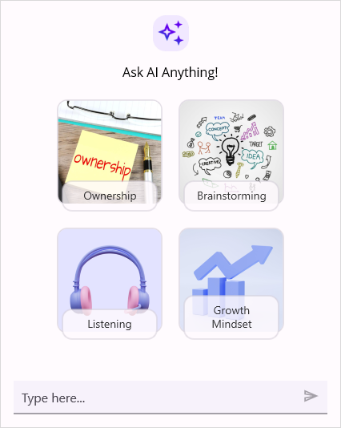

# Header in .NET MAUI AIAssistView (SfAIAssistView)

This section explains how to define and customize the header in the `SfAIAssistView`.

## Header customization

The `SfAIAssistView` allows you to add and customize appearance of the header setting the `SfAIAssistView.HeaderTemplate` property.



    <syncfusion:SfAIAssistView x:Name="sfAIAssistView"
                               AssistItems="{Binding AssistItems}"
                               ShowHeader="True">
        <syncfusion:SfSfAIAssistView.HeaderTemplate>
            <DataTemplate>
              <Grid BackgroundColor="Blue" HeightRequest="100">
                <Label LineBreakMode="NoWrap" Text="How May I Assist You Today?" FontAttributes="Bold"
                       FontSize="20" TextColor="White" HorizontalOptions="Center"   VerticalOptions="Center"/>
              </Grid>
            </DataTemplate>
        </syncfusion:SfSfAIAssistView.HeaderTemplate>
    </syncfusion:SfSfAIAssistView>
</ContentPage>



sfAIAssistView.HeaderTemplate = new DataTemplate(() =>
{
   var grid = new Grid();
   grid.BackgroundColor = Colors.Blue;
   var headerLabel = new Label
   {
       TextColor = Colors.White,
       FontSize = 20,
       FontAttributes = FontAttributes.Bold,
       Text = "How May I Assist You Today?"
   };

   grid.Children.Add(headerLabel);

   return grid;
});



## Header Text

In `SfAIAssistView`, you can use the HeaderText property to provide customized text as the header.



         <sfAIAssistView:SfAIAssistView x:Name="sfAIAssistView"
                                        AssistItems="{Binding AssistItems}"
                                        HeaderText="Ask AI"
                                        ShowHeader="True"/>  

 

 

    SfAIAssistView sfAIAssistView; 
    public MainPage() 
    { 
        InitializeComponent(); 
        this.sfAIAssistView = new SfAIAssistView();
        this.sfAIAssistView.AssistItems = viewModel.AssistItems; 
        this.sfAIAssistView.HeaderText = "AI";
        this.sfAIAssistView.ShowHeader = true;
        this.Content = sfAIAssistView; 
     } 




## Show Header

The `SfAIAssistView` shows default header if `ShowHeader` property is set to true. 



         <sfAIAssistView:SfAIAssistView x:Name="sfAIAssistView"
                                        AssistItems="{Binding AssistItems}"
                                        ShowHeader="True"/>  

 

    SfAIAssistView sfAIAssistView; 
    public MainPage() 
    { 
        InitializeComponent(); 
        this.sfAIAssistView = new SfAIAssistView();
        this.sfAIAssistView.AssistItems = viewModel.AssistItems; 
        this.sfAIAssistView.ShowHeader = true;
        this.Content = sfAIAssistView; 
     } 



