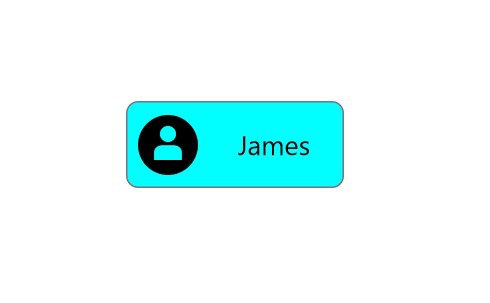
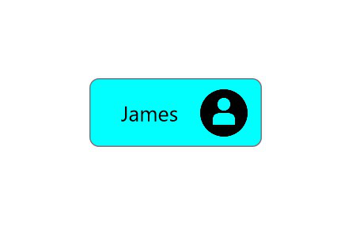

# Customization in Xamarin Chips

The chip control supports to customize the background color, border color, close button color, and more. The chip control can be customized using the following properties:

## ShowCloseButton

The [`ShowCloseButton`] property sets the visible state of close button in SfChip.





<ContentPage xmlns="http://schemas.microsoft.com/dotnet/2021/maui"
    xmlns:x="http://schemas.microsoft.com/winfx/2009/xaml"
    xmlns:core ="clr-namespace:Syncfusion.Maui.Core;assembly=Syncfusion.Maui.Core"
    xmlns:x="http://schemas.microsoft.com/winfx/2009/xaml"
    xmlns:local="clr-namespace:ChipCustomization"
    x:Class="ChipCustomization.MainPage">
  
   <ContentPage.Content>
        <StackLayout Margin="8,8,8,8" >
           <core:SfChip  Text="James" 
                            WidthRequest="150"
                            HorizontalOptions="Center"
                            VerticalOptions="Center"
                            ShowCloseButton="true" >
           </core:SfChip>  
        </StackLayout>
    </ContentPage.Content>
    
</ContentPage>





using System;
using Syncfusion.Maui.Core;

namespace ChipCustomization
{
    public partial class MainPage : ContentPage
    {
        public MainPage()
        {
            InitializeComponent();
            StackLayout stackLayout = new StackLayout();
            SfChip chip = new SfChip();
            chip.Text = "James";
            chip.WidthRequest = 150;
            chip.HorizontalOptions = LayoutOptions.Center;
            chip.VerticalOptions = LayoutOptions.Center;
            chip.ShowCloseButton = true;
            stackLayout.Children.Add(chip);
            this.Content = stackLayout;
        }
    }
}





N> The default value of ShowCloseButton is [`false`].

## ShowSelectionIndicator

The [`ShowSelectionIndicator`] property sets the visible state of selection indicator in SfChip.





<ContentPage 
	xmlns="http://schemas.microsoft.com/dotnet/2021/maui"
    xmlns:x="http://schemas.microsoft.com/winfx/2009/xaml"
    xmlns:core ="clr-namespace:Syncfusion.Maui.Core;assembly=Syncfusion.Maui.Core"
    xmlns:x="http://schemas.microsoft.com/winfx/2009/xaml"
    xmlns:local="clr-namespace:ChipCustomization"
    x:Class="ChipCustomization.MainPage">
  
   <ContentPage.Content>
        <StackLayout Margin="8,8,8,8" >
           <core:SfChip  Text="James" 
                            WidthRequest="150"
                            HorizontalOptions="Center"
                            VerticalOptions="Center"
                            ShowCloseButton="true"
                            ShowSelectionIndicator="true"
                            >
           </core:SfChip>  
        </StackLayout>
    </ContentPage.Content>
    
</ContentPage>





using System;
using Syncfusion.Maui.Core;

namespace ChipCustomization
{
    public partial class MainPage : ContentPage
    {
        public MainPage()
        {
            InitializeComponent();
            StackLayout stackLayout = new StackLayout();
            SfChip chip = new SfChip();
            chip.Text = "James";
            chip.WidthRequest = 150;
            chip.HorizontalOptions = LayoutOptions.Center;
            chip.VerticalOptions = LayoutOptions.Center;
            chip.ShowCloseButton = true;
            chip.ShowSelectionIndicator = true;
            stackLayout.Children.Add(chip);
            this.Content = stackLayout;
        }
    }
}





N> The default value of ShowSelectionIndicator is [`false`].

## CloseButtonColor

The [`CloseButtonColor`] property customizes the color of the close button in SfChip.





<ContentPage 
	xmlns="http://schemas.microsoft.com/dotnet/2021/maui"
    xmlns:x="http://schemas.microsoft.com/winfx/2009/xaml"
    xmlns:core ="clr-namespace:Syncfusion.Maui.Core;assembly=Syncfusion.Maui.Core"
    xmlns:x="http://schemas.microsoft.com/winfx/2009/xaml"
    xmlns:local="clr-namespace:ChipCustomization"
    x:Class="ChipCustomization.MainPage">
  
   <ContentPage.Content>
        <StackLayout Margin="8,8,8,8" >
           <core:SfChip  Text="James" 
                            WidthRequest="150"
                            HorizontalOptions="Center"
                            VerticalOptions="Center"
                            ShowCloseButton="true"
                            CloseButtonColor="White"
                            >
           </core:SfChip>  
        </StackLayout>
    </ContentPage.Content>
    
</ContentPage>





using System;
using Syncfusion.Maui.Core;

namespace ChipCustomization
{
    public partial class MainPage : ContentPage
    {
        public MainPage()
        {
            InitializeComponent();
            StackLayout stackLayout = new StackLayout();
            SfChip chip = new SfChip();
            chip.Text = "James";
            chip.WidthRequest = 150;
            chip.HorizontalOptions = LayoutOptions.Center;
            chip.VerticalOptions = LayoutOptions.Center;
            chip.ShowCloseButton = true;
            chip.CloseButtonColor = Colors.Black;
            stackLayout.Children.Add(chip);
            this.Content = stackLayout;
        }
    }
}





N> The default value of CloseButtonColor is [`Color.FromHex("#6b6b6b")`].

## SelectionIndicatorColor

The [`SelectionIndicatorColor`] property customizes the selection indicator color in SfChip.





<ContentPage 
	xmlns="http://schemas.microsoft.com/dotnet/2021/maui"
    xmlns:x="http://schemas.microsoft.com/winfx/2009/xaml"
    xmlns:core ="clr-namespace:Syncfusion.Maui.Core;assembly=Syncfusion.Maui.Core"
    xmlns:x="http://schemas.microsoft.com/winfx/2009/xaml"
    xmlns:local="clr-namespace:ChipCustomization"
    x:Class="ChipCustomization.MainPage">
  
   <ContentPage.Content>
        <StackLayout Margin="8,8,8,8" >
           <core:SfChip  Text="James" 
                            WidthRequest="150"
                            HorizontalOptions="Center"
                            VerticalOptions="Center"
                            ShowCloseButton="true"
                            ShowSelectionIndicator="true"
                            CloseButtonColor = "White"
                            SelectionIndicatorColor = "White"
                            >
           </core:SfChip>  
        </StackLayout>
    </ContentPage.Content>
    
</ContentPage>





using System;
using Syncfusion.Maui.Core;

namespace ChipCustomization
{
    public partial class MainPage : ContentPage
    {
        public MainPage()
        {
            InitializeComponent();
            StackLayout stackLayout = new StackLayout();
            SfChip chip = new SfChip();
            chip.Text = "James";
            chip.WidthRequest = 150;
            chip.HorizontalOptions = LayoutOptions.Center;
            chip.VerticalOptions = LayoutOptions.Center;
            chip.ShowCloseButton = true;
            chip.ShowSelectionIndicator = true;
            chip.CloseButtonColor = Colors.White;
            chip.SelectionIndicatorColor = Colors.White;
            stackLayout.Children.Add(chip);
            this.Content = stackLayout;
        }
    }
}





N> The default value of SelectionIndicatorColor is [`Color.FromHex("#6b6b6b")`].

## BackgroundColor

The [`BackgroundColor`] property customizes the background color of SfChip.





<ContentPage 
	xmlns="http://schemas.microsoft.com/dotnet/2021/maui"
    xmlns:x="http://schemas.microsoft.com/winfx/2009/xaml"
    xmlns:core ="clr-namespace:Syncfusion.Maui.Core;assembly=Syncfusion.Maui.Core"
    xmlns:x="http://schemas.microsoft.com/winfx/2009/xaml"
    xmlns:local="clr-namespace:ChipCustomization"
    x:Class="ChipCustomization.MainPage">
  
   <ContentPage.Content>
        <StackLayout Margin="8,8,8,8" >
           <core:SfChip  Text="James" 
                            WidthRequest="150"
                            HorizontalOptions="Center"
                            VerticalOptions="Center"
                            ShowCloseButton="true"
                            ShowSelectionIndicator="true"
                            CloseButtonColor = "White"
                            SelectionIndicatorColor = "White"
                            BackgroundColor="#512dcd"
                            >
           </core:SfChip>  
        </StackLayout>
    </ContentPage.Content>
    
</ContentPage>





using System;
using Syncfusion.Maui.Core;

namespace ChipCustomization
{
    public partial class MainPage : ContentPage
    {
        public MainPage()
        {
            InitializeComponent();
            StackLayout stackLayout = new StackLayout();
            SfChip chip = new SfChip();
            chip.Text = "James";
            chip.WidthRequest = 150;
            chip.HorizontalOptions = LayoutOptions.Center;
            chip.VerticalOptions = LayoutOptions.Center;
            chip.ShowSelectionIndicator = true;
            chip.CloseButtonColor = Colors.White;
            chip.SelectionIndicatorColor = Colors.White;
            chip.BackgroundColor = Colors.Aqua;
            stackLayout.Children.Add(chip);
            this.Content = stackLayout;
        }
    }
}





N> The default value of BackgroundColor is [`Color.Accent`].

## Stroke

The [`Stroke`] property customizes the color of border in SfChip.





<ContentPage 
	xmlns="http://schemas.microsoft.com/dotnet/2021/maui"
    xmlns:x="http://schemas.microsoft.com/winfx/2009/xaml"
    xmlns:core ="clr-namespace:Syncfusion.Maui.Core;assembly=Syncfusion.Maui.Core"
    xmlns:x="http://schemas.microsoft.com/winfx/2009/xaml"
    xmlns:local="clr-namespace:ChipCustomization"
    x:Class="ChipCustomization.MainPage">
  
   <ContentPage.Content>
        <StackLayout Margin="8,8,8,8" >
           <core:SfChip  Text="James" 
                            WidthRequest="150"
                            HorizontalOptions="Center"
                            VerticalOptions="Center"
                            Stroke="Black"
                            >
           </core:SfChip>  
        </StackLayout>
    </ContentPage.Content>
    
</ContentPage>





using System;
using Syncfusion.Maui.Core;

namespace ChipCustomization
{
    public partial class MainPage : ContentPage
    {
        public MainPage()
        {
            InitializeComponent();
            StackLayout stackLayout = new StackLayout();
            SfChip chip = new SfChip();
            chip.Text = "James";
            chip.WidthRequest = 150;
            chip.HorizontalOptions = LayoutOptions.Center;
            chip.VerticalOptions = LayoutOptions.Center;
            chip.Stroke = Colors.Black;
            stackLayout.Children.Add(chip);
            this.Content = stackLayout;
        }
    }
}





N> The default value of BorderColor is [`Color.Transparent`].

## StrokeThickness

The [`StrokeThickness`] property is used to customizes the border thickness of the SfChip on four sides.





<ContentPage 
	xmlns="http://schemas.microsoft.com/dotnet/2021/maui"
    xmlns:x="http://schemas.microsoft.com/winfx/2009/xaml"
    xmlns:core ="clr-namespace:Syncfusion.Maui.Core;assembly=Syncfusion.Maui.Core"
    xmlns:x="http://schemas.microsoft.com/winfx/2009/xaml"
    xmlns:local="clr-namespace:ChipCustomization"
    x:Class="ChipCustomization.MainPage">
  
   <ContentPage.Content>
        <StackLayout Margin="8,8,8,8" >
           <core:SfChip  Text="James" 
                            WidthRequest="150"
                            HorizontalOptions="Center"
                            VerticalOptions="Center"
                            StrokeThickness="5"
                            Stroke = "Black" 
                           >
           </core:SfChip>  
        </StackLayout>
    </ContentPage.Content>
    
</ContentPage>





using System;
using Syncfusion.Maui.Core;

namespace ChipCustomization
{
    public partial class MainPage : ContentPage
    {
        public MainPage()
        {
            InitializeComponent();
            StackLayout stackLayout = new StackLayout();
            SfChip chip = new SfChip();
            chip.Text = "James";
            chip.WidthRequest = 150;
            chip.HorizontalOptions = LayoutOptions.Center;
            chip.VerticalOptions = LayoutOptions.Center;
            chip.StrokeThickness = 5;
            chip.CornerRadius = 5;
            chip.Stroke = Colors.Black;
            stackLayout.Children.Add(chip);
            this.Content = stackLayout;
        }
    }
}





## CornerRadius

The `CornerRadius` property is used to customize the rounded edges in SfChip as demonstrated in the following code sample.





<ContentPage 
	xmlns="http://schemas.microsoft.com/dotnet/2021/maui"
    xmlns:x="http://schemas.microsoft.com/winfx/2009/xaml"
    xmlns:core ="clr-namespace:Syncfusion.Maui.Core;assembly=Syncfusion.Maui.Core"
    xmlns:x="http://schemas.microsoft.com/winfx/2009/xaml"
    xmlns:local="clr-namespace:ChipCustomization"
    x:Class="ChipCustomization.MainPage">
  
   <ContentPage.Content>
        <StackLayout Margin="8,8,8,8" >
           <core:SfChip  Text="James" 
                            WidthRequest="150"
                            HorizontalOptions="Center"
                            VerticalOptions="Center"
                            CornerRadius = "4"
                            Stroke="Black"
                            >
           </core:SfChip>  
        </StackLayout>
    </ContentPage.Content>
    
</ContentPage>





using System;
using Syncfusion.Maui.Core;

namespace ChipCustomization
{
    public partial class MainPage : ContentPage
    {
        public MainPage()
        {
            InitializeComponent();
            StackLayout stackLayout = new StackLayout();
            SfChip chip = new SfChip();
            chip.Text = "James";
            chip.WidthRequest = 150;
            chip.HorizontalOptions = LayoutOptions.Center;
            chip.VerticalOptions = LayoutOptions.Center;
            chip.CornerRadius = 4;
            chip.Stroke = Colors.Black;
            stackLayout.Children.Add(chip);
            this.Content = stackLayout;
        }
    }
}





N> The default value of CornerRadius is [`Thickness(0)`].

## FontAttributes

The [`FontAttributes`] property customizes the font style of text in SfChip.





<ContentPage 
	xmlns="http://schemas.microsoft.com/dotnet/2021/maui"
    xmlns:x="http://schemas.microsoft.com/winfx/2009/xaml"
    xmlns:core ="clr-namespace:Syncfusion.Maui.Core;assembly=Syncfusion.Maui.Core"
    xmlns:x="http://schemas.microsoft.com/winfx/2009/xaml"
    xmlns:local="clr-namespace:ChipCustomization"
    x:Class="ChipCustomization.MainPage">
  
   <ContentPage.Content>
        <StackLayout Margin="8,8,8,8" >
           <core:SfChip  Text="James" 
                            WidthRequest="150"
                            HorizontalOptions="Center"
                            VerticalOptions="Center"
                            ShowCloseButton="true"
                            ShowSelectionIndicator="true"
                            CloseButtonColor = "White"
                            SelectionIndicatorColor = "White"
                            FontAttributes="Italic" >
           </core:SfChip>  
        </StackLayout>
    </ContentPage.Content>
    
</ContentPage>





using System;
using Syncfusion.Maui.Core;

namespace ChipCustomization
{
    public partial class MainPage : ContentPage
    {
        public MainPage()
        {
            InitializeComponent();
            StackLayout stackLayout = new StackLayout();
            SfChip chip = new SfChip();
            chip.Text = "James";
            chip.WidthRequest = 150;
            chip.HorizontalOptions = LayoutOptions.Center;
            chip.VerticalOptions = LayoutOptions.Center;
            chip.ShowSelectionIndicator = true;
            chip.CloseButtonColor = Colors.White;
            chip.SelectionIndicatorColor = Colors.White;
            chip.FontAttributes = FontAttributes.Italic;
            stackLayout.Children.Add(chip);
            this.Content = stackLayout;
        }
    }
}





## FontFamily

The [`FontFamily`] property customizes the font family of text in SfChip.





<ContentPage 
	xmlns="http://schemas.microsoft.com/dotnet/2021/maui"
    xmlns:x="http://schemas.microsoft.com/winfx/2009/xaml"
    xmlns:core ="clr-namespace:Syncfusion.Maui.Core;assembly=Syncfusion.Maui.Core"
    xmlns:x="http://schemas.microsoft.com/winfx/2009/xaml"
    xmlns:local="clr-namespace:ChipCustomization"
    x:Class="ChipCustomization.MainPage">
  
   <ContentPage.Content>
        <StackLayout Margin="8,8,8,8" >
           <core:SfChip  Text="James" 
                            WidthRequest="150"
                            HorizontalOptions="Center"
                            VerticalOptions="Center"
                            ShowCloseButton="true"
                            ShowSelectionIndicator="true"
                            CloseButtonColor = "White"
                            SelectionIndicatorColor = "White"
                            FontFamily="times new roman"
                            >
           </core:SfChip>  
        </StackLayout>
    </ContentPage.Content>
    
</ContentPage>





using System;
using Syncfusion.Maui.Core;

namespace ChipCustomization
{
    public partial class MainPage : ContentPage
    {
        public MainPage()
        {
            InitializeComponent();
            StackLayout stackLayout = new StackLayout();
            SfChip chip = new SfChip();
            chip.Text = "James";
            chip.WidthRequest = 150;
            chip.HorizontalOptions = LayoutOptions.Center;
            chip.VerticalOptions = LayoutOptions.Center;
            chip.ShowSelectionIndicator = true;
            chip.CloseButtonColor = Colors.White;
            chip.SelectionIndicatorColor = Colors.White;
            chip.FontFamily = "times new roman";
            stackLayout.Children.Add(chip);
            this.Content = stackLayout;
        }
    }
}





## FontSize

The [`FontSize`] property customizes the size of text in SfChip.





<ContentPage 
	xmlns="http://schemas.microsoft.com/dotnet/2021/maui"
    xmlns:x="http://schemas.microsoft.com/winfx/2009/xaml"
    xmlns:core ="clr-namespace:Syncfusion.Maui.Core;assembly=Syncfusion.Maui.Core"
    xmlns:x="http://schemas.microsoft.com/winfx/2009/xaml"
    xmlns:local="clr-namespace:ChipCustomization"
    x:Class="ChipCustomization.MainPage">
  
   <ContentPage.Content>
        <StackLayout Margin="8,8,8,8" >
           <core:SfChip  Text="James" 
                            WidthRequest="150"
                            HorizontalOptions="Center"
                            VerticalOptions="Center"
                            ShowCloseButton="true"
                            ShowSelectionIndicator="true"
                            CloseButtonColor = "White"
                            SelectionIndicatorColor = "White"
                            FontSize = "10"
                            >
           </core:SfChip>  
        </StackLayout>
    </ContentPage.Content>
    
</ContentPage>





using System;
using Syncfusion.Maui.Core;

namespace ChipCustomization
{
    public partial class MainPage : ContentPage
    {
        public MainPage()
        {
            InitializeComponent();
            StackLayout stackLayout = new StackLayout();
            SfChip chip = new SfChip();
            chip.Text = "James";
            chip.WidthRequest = 150;
            chip.HorizontalOptions = LayoutOptions.Center;
            chip.VerticalOptions = LayoutOptions.Center;
            chip.ShowSelectionIndicator = true;
            chip.CloseButtonColor = Colors.White;
            chip.SelectionIndicatorColor = Colors.White;
            chip.FontSize = 10;
            stackLayout.Children.Add(chip);
            this.Content = stackLayout;
        }
    }
}





N> Default Value of FontSize 
   Android : [`14d`]
   iOS : [`15d`]
   UWP : [`15d`]

## TextColor

The [`TextColor`] property customizes the color of text in SfChip.





<ContentPage 
	xmlns="http://schemas.microsoft.com/dotnet/2021/maui"
    xmlns:x="http://schemas.microsoft.com/winfx/2009/xaml"
    xmlns:core ="clr-namespace:Syncfusion.Maui.Core;assembly=Syncfusion.Maui.Core"
    xmlns:x="http://schemas.microsoft.com/winfx/2009/xaml"
    xmlns:local="clr-namespace:ChipCustomization"
    x:Class="ChipCustomization.MainPage">
  
   <ContentPage.Content>
        <StackLayout Margin="8,8,8,8" >
           <core:SfChip  Text="James" 
                            WidthRequest="150"
                            HorizontalOptions="Center"
                            VerticalOptions="Center"
                            ShowCloseButton="true"
                            ShowSelectionIndicator="true"
                            CloseButtonColor = "White"
                            SelectionIndicatorColor = "White"
                            BackgroundColor="Aqua"
                            TextColor="Black"
                            >
           </core:SfChip>  
        </StackLayout>
    </ContentPage.Content>
    
</ContentPage>





using System;
using Syncfusion.Maui.Core;

namespace ChipCustomization
{
    public partial class MainPage : ContentPage
    {
        public MainPage()
        {
            InitializeComponent();
            StackLayout stackLayout = new StackLayout();
            SfChip chip = new SfChip();
            chip.Text = "James";
            chip.WidthRequest = 150;
            chip.HorizontalOptions = LayoutOptions.Center;
            chip.VerticalOptions = LayoutOptions.Center;
            chip.ShowSelectionIndicator = true;
            chip.CloseButtonColor = Colors.White;
            chip.SelectionIndicatorColor = Colors.White;
            chip.BackgroundColor = Colors.Aqua;
            chip.TextColor = Colors.Black;
            stackLayout.Children.Add(chip);
            this.Content = stackLayout;
        }
    }
}





N> The default value of TextColor is [`Color.White`].

## TextAlignment

The [`HorizontalTextAlignment `] and [`VerticalTextAlignment `] properties customize the alignment of text in SfChip.





<ContentPage 
	xmlns="http://schemas.microsoft.com/dotnet/2021/maui"
    xmlns:x="http://schemas.microsoft.com/winfx/2009/xaml"
    xmlns:core ="clr-namespace:Syncfusion.Maui.Core;assembly=Syncfusion.Maui.Core"
    xmlns:x="http://schemas.microsoft.com/winfx/2009/xaml"
    xmlns:local="clr-namespace:ChipCustomization"
    x:Class="ChipCustomization.MainPage">
  
   <ContentPage.Content>
        <StackLayout Margin="8,8,8,8" >
           <core:SfChip  Text="James" 
                            WidthRequest="150"
                            HorizontalOptions="Center"
                            VerticalOptions="Center"
                            ShowSelectionIndicator="true"
                            SelectionIndicatorColor = "White"
                            BackgroundColor="Aqua"
                            HorizontalTextAlignment="Start"
                            VerticalTextAlignment="Start"
                            TextColor="Black"
                            >
           </core:SfChip>  
        </StackLayout>
    </ContentPage.Content>
    
</ContentPage>





using System;
using Syncfusion.Maui.Core;

namespace ChipCustomization
{
    public partial class MainPage : ContentPage
    {
        public MainPage()
        {
            InitializeComponent();
            StackLayout stackLayout = new StackLayout();
            SfChip chip = new SfChip();
            chip.Text = "James";
            chip.WidthRequest = 150;
            chip.HorizontalOptions = LayoutOptions.Center;
            chip.VerticalOptions = LayoutOptions.Center;
            chip.ShowSelectionIndicator = true;
            chip.SelectionIndicatorColor = Colors.White;
            chip.BackgroundColor = Colors.Aqua;
            chip.HorizontalTextAlignment = TextAlignment.Start;
            chip.VerticalTextAlignment = TextAlignment.Start;
            chip.TextColor = Colors.Black;
            stackLayout.Children.Add(chip);
            this.Content = stackLayout;
        }
    }
}





N> The default values of HorizontalTextAlignment and VerticalTextAlignment are [`TextAlignment.Center`].

## ShowIcon

You can enable the icon image using the [`ShowIcon`] property to know whether any image appears to the SfChip.





<ContentPage 
	xmlns="http://schemas.microsoft.com/dotnet/2021/maui"
    xmlns:x="http://schemas.microsoft.com/winfx/2009/xaml"
    xmlns:core ="clr-namespace:Syncfusion.Maui.Core;assembly=Syncfusion.Maui.Core"
    xmlns:x="http://schemas.microsoft.com/winfx/2009/xaml"
    xmlns:local="clr-namespace:ChipCustomization"
    x:Class="ChipCustomization.MainPage">
  
   <ContentPage.Content>
        <StackLayout Margin="8,8,8,8" >
           <core:SfChip  Text="James" 
                            WidthRequest="150"
                            HorizontalOptions="Center"
                            VerticalOptions="Center"
                            BackgroundColor="Aqua"
                            TextColor="Black"
                            ImageSource="ChipUserContact.png"
                            ShowIcon="true"
                            >
           </core:SfChip>  
        </StackLayout>
    </ContentPage.Content>
    
</ContentPage>





using System;
using Syncfusion.Maui.Core;

namespace ChipCustomization
{
    public partial class MainPage : ContentPage
    {
        public MainPage()
        {
            InitializeComponent();
            StackLayout stackLayout = new StackLayout();
            SfChip chip = new SfChip();
            chip.Text = "James";
            chip.WidthRequest = 150;
            chip.HorizontalOptions = LayoutOptions.Center;
            chip.VerticalOptions = LayoutOptions.Center;
            chip.BackgroundColor = Colors.Aqua;
            chip.TextColor = Colors.Black;
            chip.ImageSource = "ChipUserContact.png";
            chip.ShowIcon = true;
            stackLayout.Children.Add(chip);
            this.Content = stackLayout;
        }
    }
}





N> The default value of ShowIcon is [`false`].

## BackgroundImage

The [`Image`] property is used to customize the height, width, image source and aspect for the image of SfChip.





<ContentPage 
	xmlns="http://schemas.microsoft.com/dotnet/2021/maui"
    xmlns:x="http://schemas.microsoft.com/winfx/2009/xaml"
    xmlns:core ="clr-namespace:Syncfusion.Maui.Core;assembly=Syncfusion.Maui.Core"
    xmlns:x="http://schemas.microsoft.com/winfx/2009/xaml"
    xmlns:local="clr-namespace:ChipCustomization"
    x:Class="ChipCustomization.MainPage">
  
   <ContentPage.Content>
        <StackLayout Margin="8,8,8,8" >
           <core:SfChip  Text="James" 
                            WidthRequest="150"
                            HorizontalOptions="Center"
                            VerticalOptions="Center"
                            ShowIcon="true"
                            BackgroundImage="ChipUserContact.png">
           </core:SfChip>             
        </StackLayout>
    </ContentPage.Content>
    
</ContentPage>





using System;
using Syncfusion.Maui.Core;

namespace ChipCustomization
{
    public partial class MainPage : ContentPage
    {
        public MainPage()
        {
            InitializeComponent();
            StackLayout stackLayout = new StackLayout();
            SfChip chip = new SfChip();
            chip.Text = "James";
            chip.WidthRequest = 150;
            chip.HorizontalOptions = LayoutOptions.Center;
            chip.VerticalOptions = LayoutOptions.Center;
            chip.BackgroundColor = Colors.Aqua;
            chip.TextColor = Colors.Black;
            chip.ShowIcon = true;
            chip.BackgroundImage="ChipUserContact.png";
            stackLayout.Children.Add(chip);
            this.Content = stackLayout;
        }
    }
}





## ImageSource

The [`ImageSource`] property customizes the icon image of SfChip by adding a custom image.

N> Enable the [`ShowIcon`] property to enable the [`ImageSource`] property.





<ContentPage 
	xmlns="http://schemas.microsoft.com/dotnet/2021/maui"
    xmlns:x="http://schemas.microsoft.com/winfx/2009/xaml"
    xmlns:core ="clr-namespace:Syncfusion.Maui.Core;assembly=Syncfusion.Maui.Core"
    xmlns:x="http://schemas.microsoft.com/winfx/2009/xaml"
    xmlns:local="clr-namespace:ChipCustomization"
    x:Class="ChipCustomization.MainPage">
  
   <ContentPage.Content>
        <StackLayout Margin="8,8,8,8" >
           <core:SfChip  Text="James" 
                            WidthRequest="150"
                            HorizontalOptions="Center"
                            VerticalOptions="Center"
                            BackgroundColor="Aqua"
                            TextColor="Black"
                            ImageSource="ChipUserContact.png"
                            ShowIcon="true"
                            >
           </core:SfChip>  
        </StackLayout>
    </ContentPage.Content>
    
</ContentPage>





using System;
using Syncfusion.Maui.Core;

namespace ChipCustomization
{
    public partial class MainPage : ContentPage
    {
        public MainPage()
        {
            InitializeComponent();
            StackLayout stackLayout = new StackLayout();
            SfChip chip = new SfChip();
            chip.Text = "James";
            chip.WidthRequest = 150;
            chip.HorizontalOptions = LayoutOptions.Center;
            chip.VerticalOptions = LayoutOptions.Center;
            chip.BackgroundColor = Colors.Aqua;
            chip.TextColor = Colors.Black;
            chip.ImageSource = "ChipUserContact.png";
            chip.ShowIcon = true;
            stackLayout.Children.Add(chip);
            this.Content = stackLayout;
        }
    }
}





## ImageSize

The [`ImageSize`] property customizes the width of icon image in SfChip.

N> Enable the [`ShowIcon`] property to enable the [`ImageSource`] property.





<ContentPage 
	xmlns="http://schemas.microsoft.com/dotnet/2021/maui"
    xmlns:x="http://schemas.microsoft.com/winfx/2009/xaml"
    xmlns:core ="clr-namespace:Syncfusion.Maui.Core;assembly=Syncfusion.Maui.Core"
    xmlns:x="http://schemas.microsoft.com/winfx/2009/xaml"
    xmlns:local="clr-namespace:ChipCustomization"
    x:Class="ChipCustomization.MainPage">
  
   <ContentPage.Content>
        <StackLayout Margin="8,8,8,8" >
           <core:SfChip  Text="James" 
                            WidthRequest="150"
                            HorizontalOptions="Center"
                            VerticalOptions="Center"
                            BackgroundColor="Aqua"
                            TextColor="Black"
                            ImageSource="ChipUserContact.png"
                            ImageSize="25"
                            ShowIcon="true"
                            >
           </core:SfChip>  
        </StackLayout>
    </ContentPage.Content>
    
</ContentPage>





using System;
using Syncfusion.Maui.Core;

namespace ChipCustomization
{
    public partial class MainPage : ContentPage
    {
        public MainPage()
        {
            InitializeComponent();
            StackLayout stackLayout = new StackLayout();
            SfChip chip = new SfChip();
            chip.Text = "James";
            chip.WidthRequest = 150;
            chip.HorizontalOptions = LayoutOptions.Center;
            chip.VerticalOptions = LayoutOptions.Center;
            chip.BackgroundColor = Colors.Aqua;
            chip.TextColor = Colors.Black;
            chip.ImageSource = "ChipUserContact.png";
            chip.ImageSize = 25;
            chip.ShowIcon = true;
            stackLayout.Children.Add(chip);
            this.Content = stackLayout;
        }
    }
}





N> The default value of ImageWidth is [`32`].

## ImageAlignment 

The [`ImageAlignment`] property customizes the alignment of icon image in SfChip.

N> Enable the [`ShowIcon`] property to enable the [`ImageSource`] property.





<ContentPage 
	xmlns="http://schemas.microsoft.com/dotnet/2021/maui"
    xmlns:x="http://schemas.microsoft.com/winfx/2009/xaml"
    xmlns:core ="clr-namespace:Syncfusion.Maui.Core;assembly=Syncfusion.Maui.Core"
    xmlns:x="http://schemas.microsoft.com/winfx/2009/xaml"
    xmlns:local="clr-namespace:ChipCustomization"
    x:Class="ChipCustomization.MainPage">
  
   <ContentPage.Content>
        <StackLayout Margin="8,8,8,8" >
           <core:SfChip  Text="James" 
                            WidthRequest="150"
                            HorizontalOptions="Center"
                            VerticalOptions="Center"
                            BackgroundColor="Aqua"
                            TextColor="Black"
                            ImageSource="ChipUserContact.png"
                            ImageAlignment="End"
                            ImageSize="25"
                            ShowIcon="true"
                            >
           </core:SfChip>  
        </StackLayout>
    </ContentPage.Content>
    
</ContentPage>





using System;
using Syncfusion.Maui.Core;

namespace ChipCustomization
{
    public partial class MainPage : ContentPage
    {
        public MainPage()
        {
            InitializeComponent();
            StackLayout stackLayout = new StackLayout();
            SfChip chip = new SfChip();
            chip.Text = "James";
            chip.WidthRequest = 150;
            chip.HorizontalOptions = LayoutOptions.Center;
            chip.VerticalOptions = LayoutOptions.Center;
            chip.BackgroundColor = Colors.Aqua;
            chip.TextColor = Colors.Black;
            chip.ImageSource = "ChipUserContact.png";
            chip.ImageAlignment = Alignment.End;
            chip.ImageSize = 25;
            chip.ShowIcon = true;
            stackLayout.Children.Add(chip);
            this.Content = stackLayout;
        }
    }
}





N> The default value of ImageAlignment is [`Alignment.Start`].

## Command

The [`Command`] property associates a command with an instance of SfChip. This property is most often set with MVVM pattern to bind callbacks back into the ViewModel.





 <ContentPage 
	xmlns="http://schemas.microsoft.com/dotnet/2021/maui"
    xmlns:x="http://schemas.microsoft.com/winfx/2009/xaml"
    xmlns:core ="clr-namespace:Syncfusion.Maui.Core;assembly=Syncfusion.Maui.Core"
    xmlns:x="http://schemas.microsoft.com/winfx/2009/xaml"
    xmlns:local="clr-namespace:ChipCustomization"
    x:Class="ChipCustomization.MainPage">
 
   <ContentPage.BindingContext>
       <local:CommandDemoViewModel />
   </ContentPage.BindingContext>

   <ContentPage.Content>
        <StackLayout Margin="8,8,0,0">
            <core:SfChip x:Name="Chip" 
                            Text="Chip"
                            HorizontalOptions="Center"
                            VerticalOptions="Center"
                            WidthRequest="150"
                            ShowCloseButton="true"
                            BackgroundColor="{Binding Background}"
                            Command="{Binding ButtonCommand}">
            </core:SfChip>  
        </StackLayout>
    </ContentPage.Content>
    
</ContentPage>





// ViewModel class for Command Demo.

public class CommandDemoViewModel : INotifyPropertyChanged
{

    private Color _background = Colors.Accent;

    public Color Background
    {
        get { return _background; }
        set
        {
            _background = value;
            NotifyPropertyChanged();
        }
    }

    private void NotifyPropertyChanged([CallerMemberName] String propertyName = "")
    {
        PropertyChanged?.Invoke(this, new PropertyChangedEventArgs(propertyName));
    }

    public event PropertyChangedEventHandler PropertyChanged;

    public CommandDemoViewModel()
    {
        BackgroundColor();
        this.Background=Color.Accent;
    }

    private void BackgroundColor()
    {
        this.Background = this.Background == Colors.DeepSkyBlue ? Colors.Accent : Colors.DeepSkyBlue;
    }

    public ICommand ButtonCommand => new Command(BackgroundColor);

}





N> The default value of Command is [`null`].

## Customization of SfChipGroup

The chip group supports to customize the chip's background color, border color, text color, and more. The chip group can be customized using the following properties:

## InputView

The [`InputView`] property allows to provide a view to the input chip. In this example, the input chip is used to add an employee at run time. To get the employee name as input, an entry is added as InputView.





<ContentPage
    xmlns="http://schemas.microsoft.com/dotnet/2021/maui"
    xmlns:x="http://schemas.microsoft.com/winfx/2009/xaml"
    xmlns:core ="clr-namespace:Syncfusion.Maui.Core;assembly=Syncfusion.Maui.Core"
    xmlns:x="http://schemas.microsoft.com/winfx/2009/xaml"
    xmlns:local="clr-namespace:Chips"
    x:Class="Chips.GettingStarted">
	<ContentPage.BindingContext>
		<local:ViewModel x:Name="viewModel"/>
	</ContentPage.BindingContext>
	<ContentPage.Content>
	<core:SfChipGroup 
		x:Name="chipGroup" 
		ItemsSource="{Binding Employees}"
		ChipPadding="8,8,0,0" 
        ChipType="Input"
        FlowDirection="LeftToRight"
		DisplayMemberPath="Name">
		<core:SfChipGroup.InputView>
			<Entry x:Name="entry" 
                Placeholder="Enter Name"
				Margin="10,10,0,0" 
                VerticalOptions="Center" 
			    FontSize="15"
				WidthRequest="110"
				Completed="Entry_Completed"/>
		</coreSfChipGroup.InputView>
	</core:SfChipGroup>
	</ContentPage.Content>
</ContentPage>





using System;
using Syncfusion.Maui.Core;

namespace Chips
{
	public partial class GettingStarted: ContentPage
	{
		public GettingStarted()
		{
			InitializeComponent();
			Grid grid = new Grid();
			SfChipGroup chipGroup = new SfChipGroup();
			grid.Children.Add(chipGroup);
			var entry= new Entry { Margin = new Thickness(10, 10, 0, 0), WidthRequest = 110 };
			entry.Completed += Entry_Completed;
			chipGroup.InputView = entry;
			this.BindingContext = new ViewModel();
			chipGroup.SetBinding(SfChipGroup.ItemsSourceProperty, "Employees");
			chipGroup.DisplayMemberPath = "Name";
			chipGroup.ChipPadding = new Thickness(8, 8, 0, 0);
            chipGroup.ChipType = SfChipsType.Input;
			this.Content = grid;
		}
	}
}




N> The InputView is visible only in the Input type. The default value of InputView is [`null`].

## ChipBackground

The [`ChipBackground`] property customizes the background color of the selected chip.





<ContentPage 
	xmlns="http://schemas.microsoft.com/dotnet/2021/maui"
    xmlns:x="http://schemas.microsoft.com/winfx/2009/xaml"
    xmlns:core ="clr-namespace:Syncfusion.Maui.Core;assembly=Syncfusion.Maui.Core"
    xmlns:x="http://schemas.microsoft.com/winfx/2009/xaml"
    xmlns:local="clr-namespace:ChipCustomization"
    x:Class="ChipCustomization.MainPage">
 
 <ContentPage.BindingContext>
        <local:ViewModel/>
    </ContentPage.BindingContext>
    <ContentPage.Content>
        <StackLayout Margin="10,10,10,10">
            <core:SfChipGroup
                ItemsSource="{Binding Employees}"
                DisplayMemberPath="Name"
                ChipType="Choice">
                    <VisualStateManager.VisualStateGroups>
                    <VisualStateGroup x:Name="CommonStates">
                        <VisualState x:Name="Normal">
                            <VisualState.Setters>
                                <Setter Property="ChipBackground" Value="white" />
                            </VisualState.Setters>
                        </VisualState>
                        <VisualState x:Name="Selected">
                            <VisualState.Setters>
                                <Setter Property="ChipBackground" Value="#502cd5" />
                             </VisualState.Setters>
                        </VisualState>
                    </VisualStateGroup>
                </VisualStateManager.VisualStateGroups>
            </chip:SfChipGroup>
            </core:SfChipGroup>
        </StackLayout>  
    </ContentPage.Content>
    
</ContentPage>





using System;
using Syncfusion.Maui.Core;

namespace ChipCustomization
{
    public partial class MainPage : ContentPage
    {
        public MainPage()
        {
            InitializeComponent();
            StackLayout stack = new StackLayout();
            SfChipGroup chipGroup = new SfChipGroup();
            stack.Children.Add(chipGroup);
            chipGroup.ChipLayout = layout;
            this.BindingContext = new ViewModel();
            chipGroup.SetBinding(SfChipGroup.ItemsSourceProperty, "Employees");
            chipGroup.DisplayMemberPath = "Name";
            chipGroup.ChipType = SfChipsType.Choice;
            this.Content = stack;
        }
    }
}





N> The default value of SelectedChipBackgroundColor is [`Color.Accent`].

## ChipTextColor

The [`SelectedChipTextColor`] property customizes the text color of the selected chip.





<ContentPage 
	xmlns="http://schemas.microsoft.com/dotnet/2021/maui"
    xmlns:x="http://schemas.microsoft.com/winfx/2009/xaml"
    xmlns:core ="clr-namespace:Syncfusion.Maui.Core;assembly=Syncfusion.Maui.Core"
    xmlns:x="http://schemas.microsoft.com/winfx/2009/xaml"
    xmlns:local="clr-namespace:ChipCustomization"
    x:Class="ChipCustomization.MainPage">
 
 <ContentPage.BindingContext>
        <local:ViewModel/>
    </ContentPage.BindingContext>
    <ContentPage.Content>
        <StackLayout Margin="10,10,10,10">
            <core:SfChipGroup
                ItemsSource="{Binding Employees}"
                DisplayMemberPath="Name"
                ChipBackground="White"
                ChipTextColor="Green"
                ChipType="Choice">
            </core:SfChipGroup>
        </StackLayout>  
    </ContentPage.Content>
    
</ContentPage>





using System;
using Syncfusion.Maui.Core;

namespace ChipCustomization
{
    public partial class MainPage : ContentPage
    {
        public MainPage()
        {
            InitializeComponent();
            StackLayout stack = new StackLayout();
            SfChipGroup chipGroup = new SfChipGroup();
            stack.Children.Add(chipGroup);
            chipGroup.ChipLayout = layout;
            this.BindingContext = new ViewModel();
            chipGroup.SetBinding(SfChipGroup.ItemsSourceProperty, "Employees");
            chipGroup.DisplayMemberPath = "Name";
            chipGroup.ChipBackground = Colors.White;
            chipGroup.ChipTextColor = Colors.Green;
            chipGroup.ChipType = SfChipsType.Choice;
            this.Content = stack;
        }
    }
}





N> The default value of SelectedChipTextColor is [`Color.White`].

## ChipBackground

The [`ChipBackgroundColor`] property customizes the background color of the SfChipGroup.





<ContentPage 
	xmlns="http://schemas.microsoft.com/dotnet/2021/maui"
    xmlns:x="http://schemas.microsoft.com/winfx/2009/xaml"
    xmlns:core ="clr-namespace:Syncfusion.Maui.Core;assembly=Syncfusion.Maui.Core"
    xmlns:x="http://schemas.microsoft.com/winfx/2009/xaml"
    xmlns:local="clr-namespace:ChipCustomization"
    x:Class="ChipCustomization.MainPage">
 
 <ContentPage.BindingContext>
        <local:ViewModel/>
    </ContentPage.BindingContext>
    <ContentPage.Content>
        <StackLayout Margin="10,10,10,10">
            <core:SfChipGroup
                ItemsSource="{Binding Employees}"
                DisplayMemberPath="Name"
                ChipBackground="#512dcd"
                ChipType="Choice">
            </core:SfChipGroup>
        </StackLayout>  
    </ContentPage.Content>
    
</ContentPage>





using System;
using Syncfusion.Maui.Core;

namespace ChipCustomization
{
    public partial class MainPage : ContentPage
    {
        public MainPage()
        {
            InitializeComponent();
            StackLayout stack = new StackLayout();
            SfChipGroup chipGroup = new SfChipGroup();
            stack.Children.Add(chipGroup);
            chipGroup.ChipLayout = layout;
            this.BindingContext = new ViewModel();
            chipGroup.SetBinding(SfChipGroup.ItemsSourceProperty, "Employees");
            chipGroup.DisplayMemberPath = "Name";
            chipGroup.ChipBackground = Colors.Aqua;
            chipGroup.ChipType = SfChipsType.Choice;
            this.Content = stack;
        }
    }
}





N> The default value of ChipBackground is [`Color.FromHex("#E0E0E0")`].

## ChipStroke

The [`ChipStroke`] property customizes the border color of the SfChipGroup.





 <ContentPage 
	xmlns="http://schemas.microsoft.com/dotnet/2021/maui"
    xmlns:x="http://schemas.microsoft.com/winfx/2009/xaml"
    xmlns:core ="clr-namespace:Syncfusion.Maui.Core;assembly=Syncfusion.Maui.Core"
    xmlns:x="http://schemas.microsoft.com/winfx/2009/xaml"
    xmlns:local="clr-namespace:ChipCustomization"
    x:Class="ChipCustomization.MainPage">
 
 <ContentPage.BindingContext>
        <local:ViewModel/>
    </ContentPage.BindingContext>
    <ContentPage.Content>
        <StackLayout Margin="10,10,10,10">
            <core:SfChipGroup
                ItemsSource="{Binding Employees}"
                DisplayMemberPath="Name"
                ChipStrokeThickness="5" 
                ChipStroke="Black"
                ChipBackground="#512dcd">
            </core:SfChipGroup>
        </StackLayout>  
    </ContentPage.Content>
    
</ContentPage>





using System;
using Syncfusion.Maui.Core;

namespace ChipCustomization
{
    public partial class MainPage : ContentPage
    {
        public MainPage()
        {
            InitializeComponent();
            StackLayout stack = new StackLayout();
            SfChipGroup chipGroup = new SfChipGroup();
            stack.Children.Add(chipGroup);
            chipGroup.ChipLayout = layout;
            this.BindingContext = new ViewModel();
            chipGroup.SetBinding(SfChipGroup.ItemsSourceProperty, "Employees");
            chipGroup.DisplayMemberPath = "Name";
            chipGroup.ChipStrokeThickness = 5;
            chipGroup.ChipStroke = Colors.Black;
            chipGroup.ChipBackground = Colors.#512dcd;
            this.Content = stack;
        }
    }
}





N> The default value of ChipBorderColor is [`Color.Transparent`].

## ChipTextColor

The [`ChipTextColor`] property customizes the text color of the SfChipGroup.





<ContentPage xmlns="http://schemas.microsoft.com/dotnet/2021/maui"
    xmlns:x="http://schemas.microsoft.com/winfx/2009/xaml"
    xmlns:core ="clr-namespace:Syncfusion.Maui.Core;assembly=Syncfusion.Maui.Core"
    xmlns:x="http://schemas.microsoft.com/winfx/2009/xaml"
    xmlns:local="clr-namespace:ChipCustomization"
    x:Class="ChipCustomization.MainPage">
 
 <ContentPage.BindingContext>
        <local:ViewModel/>
    </ContentPage.BindingContext>
    <ContentPage.Content>
        <StackLayout Margin="10,10,10,10">
            <core:SfChipGroup
                ItemsSource="{Binding Employees}"
                DisplayMemberPath="Name"
                ChipTextColor="Blue">
            </core:SfChipGroup>
          
        </StackLayout>  
    </ContentPage.Content>
    
</ContentPage>





using System;
using Syncfusion.Maui.Core;

namespace ChipCustomization
{
    public partial class MainPage : ContentPage
    {
        public MainPage()
        {
            InitializeComponent();
            StackLayout stack = new StackLayout();
            SfChipGroup chipGroup = new SfChipGroup();
            stack.Children.Add(chipGroup);
            chipGroup.ChipLayout = layout;
            this.BindingContext = new ViewModel();
            chipGroup.SetBinding(SfChipGroup.ItemsSourceProperty, "Employees");
            chipGroup.DisplayMemberPath = "Name";
            chipGroup.ChipTextColor = Color.Blue;
            this.Content = stack;
        }
    }
}





N> The default value of ChipTextColor is [`Color.FromHex("#212121")`].

## ChipTextSize

The [`ChipTextSize`] property customizes the text size of the SfChipGroup.





<ContentPage 
	xmlns="http://schemas.microsoft.com/dotnet/2021/maui"
    xmlns:x="http://schemas.microsoft.com/winfx/2009/xaml"
    xmlns:core ="clr-namespace:Syncfusion.Maui.Core;assembly=Syncfusion.Maui.Core"
    xmlns:x="http://schemas.microsoft.com/winfx/2009/xaml"
    xmlns:local="clr-namespace:ChipCustomization"
    x:Class="ChipCustomization.MainPage">
 
 <ContentPage.BindingContext>
        <local:ViewModel/>
    </ContentPage.BindingContext>
    <ContentPage.Content>
        <StackLayout Margin="8,8,0,0">
            <core:SfChipGroup
                ItemsSource="{Binding Employees}"
                DisplayMemberPath="Name"
                ChipTextSize="10">
            </core:SfChipGroup>
         
        </StackLayout>  
    </ContentPage.Content>
    
</ContentPage>





using System;
using Syncfusion.Maui.Core;

namespace ChipCustomization
{
    public partial class MainPage : ContentPage
    {
        public MainPage()
        {
            InitializeComponent();
            StackLayout stack = new StackLayout();
            SfChipGroup chipGroup = new SfChipGroup();
            stack.Children.Add(chipGroup);
            chipGroup.ChipLayout = layout;
            this.BindingContext = new ViewModel();
            chipGroup.SetBinding(SfChipGroup.ItemsSourceProperty, "Employees");
            chipGroup.DisplayMemberPath = "Name";
            chipGroup.ChipTextSize = 10;
            this.Content = stack;
        }
    }
}





N> The default value of ChipTextSize is [`14d`].

## ChipPadding

The [`ChipPadding`] property sets spacing between each chip.





  <ContentPage 
	xmlns="http://schemas.microsoft.com/dotnet/2021/maui"
    xmlns:x="http://schemas.microsoft.com/winfx/2009/xaml"
    xmlns:core ="clr-namespace:Syncfusion.Maui.Core;assembly=Syncfusion.Maui.Core"
    xmlns:x="http://schemas.microsoft.com/winfx/2009/xaml"
    xmlns:local="clr-namespace:ChipCustomization"
    x:Class="ChipCustomization.MainPage">
 
 <ContentPage.BindingContext>
        <local:ViewModel/>
    </ContentPage.BindingContext>
    <ContentPage.Content>
        <StackLayout Margin="8,8,0,0">
            <core:SfChipGroup
                ItemsSource="{Binding Employees}"
                DisplayMemberPath="Name"
                ChipPadding="8,0,0,0">
            </core:SfChipGroup>
        </StackLayout>  
    </ContentPage.Content>
    
</ContentPage>





using System;
using Syncfusion.Maui.Core;

namespace ChipCustomization
{
    public partial class MainPage : ContentPage
    {
        public MainPage()
        {
            InitializeComponent();
            StackLayout stack = new StackLayout();
            SfChipGroup chipGroup = new SfChipGroup();
            stack.Children.Add(chipGroup);
            chipGroup.ChipLayout = layout;
            this.BindingContext = new ViewModel();
            chipGroup.SetBinding(SfChipGroup.ItemsSourceProperty, "Employees");
            chipGroup.ChipPadding = new Thickness(8, 0, 0, 0);
            chipGroup.DisplayMemberPath = "Name";
            this.Content = stack;
        }
    }
}





	
N> The default value of ChipPadding is [`Thickness(5d, 0, 0, 0)`].

## ChipStrokeThickness

The [`ChipBorderWidth`] property customizes the border width of the SfChipGroup.





<ContentPage 
	xmlns="http://schemas.microsoft.com/dotnet/2021/maui"
    xmlns:x="http://schemas.microsoft.com/winfx/2009/xaml"
    xmlns:core ="clr-namespace:Syncfusion.Maui.Core;assembly=Syncfusion.Maui.Core"
    xmlns:x="http://schemas.microsoft.com/winfx/2009/xaml"
    xmlns:local="clr-namespace:ChipCustomization"
    x:Class="ChipCustomization.MainPage">
 
 <ContentPage.BindingContext>
        <local:ViewModel/>
    </ContentPage.BindingContext>
    <ContentPage.Content>
        <StackLayout Margin="8,8,0,0">
            <core:SfChipGroup
                ItemsSource="{Binding Employees}"
                ChipStrokeThickness="5"
                DisplayMemberPath="Name"
                ChipStroke="Black">
            </core:SfChipGroup>
        </StackLayout>  
    </ContentPage.Content>
    
</ContentPage>





using System;
using Syncfusion.Maui.Core;

namespace ChipCustomization
{
    public partial class MainPage : ContentPage
    {
        public MainPage()
        {
            InitializeComponent();
            StackLayout stack = new StackLayout();
            SfChipGroup chipGroup = new SfChipGroup();
            stack.Children.Add(chipGroup);
            chipGroup.ChipLayout = layout;
            this.BindingContext = new ViewModel();
            chipGroup.SetBinding(SfChipGroup.ItemsSourceProperty, "Employees");
            chipGroup.ChipStrokeThickness = 5;
            chipGroup.ChipStroke = Color.Black;
            chipGroup.DisplayMemberPath = "Name";
            this.Content = stack;
        }
    }
}





N> The default value of ChipBorderWidth is [`0d`].

## ItemHeight

The [`ItemHeight`] property customizes the height of the items in the SfChipGroup.





<ContentPage 
	xmlns="http://schemas.microsoft.com/dotnet/2021/maui"
    xmlns:x="http://schemas.microsoft.com/winfx/2009/xaml"
    xmlns:core ="clr-namespace:Syncfusion.Maui.Core;assembly=Syncfusion.Maui.Core"
    xmlns:x="http://schemas.microsoft.com/winfx/2009/xaml"
    xmlns:local="clr-namespace:ChipCustomization"
    x:Class="ChipCustomization.MainPage">
 
 <ContentPage.BindingContext>
        <local:ViewModel/>
    </ContentPage.BindingContext>
    <ContentPage.Content>
        <StackLayout Margin="8,8,0,0">
            <core:SfChipGroup
                ItemsSource="{Binding Employees}"
                ItemHeight="60"
                DisplayMemberPath="Name"
                >
            </core:SfChipGroup>
        </StackLayout>  
    </ContentPage.Content>
    
</ContentPage>





using System;
using Syncfusion.Maui.Core;

namespace ChipCustomization
{
    public partial class MainPage : ContentPage
    {
        public MainPage()
        {
            InitializeComponent();
            StackLayout stack = new StackLayout();
            SfChipGroup chipGroup = new SfChipGroup();
            stack.Children.Add(chipGroup);
            chipGroup.ChipLayout = layout;
            this.BindingContext = new ViewModel();
            chipGroup.SetBinding(SfChipGroup.ItemsSourceProperty, "Employees");
            chipGroup.ItemHeight = 60;
            chipGroup.DisplayMemberPath = "Name";
            this.Content = stack;
        }
    }
}





N> The default value of ItemHeight is [`double.NaN`].

## ShowIcon

You can enable the icon image using the [`ShowIcon`] property to know whether any image appears on the SfChipGroup.





 <ContentPage 
	xmlns="http://schemas.microsoft.com/dotnet/2021/maui"
    xmlns:x="http://schemas.microsoft.com/winfx/2009/xaml"
    xmlns:core ="clr-namespace:Syncfusion.Maui.Core;assembly=Syncfusion.Maui.Core"
    xmlns:x="http://schemas.microsoft.com/winfx/2009/xaml"
    xmlns:local="clr-namespace:ChipCustomization"
    x:Class="ChipCustomization.MainPage">
 
<ContentPage.BindingContext>
        <local:ViewModel x:Name="viewModel"/>
    </ContentPage.BindingContext>
    <ContentPage.Content>
        <Grid>
            <core:SfChipGroup 
                ItemsSource="{Binding Employees}" 
                ChipPadding="8,8,0,0" 
                ImageMemberPath="Image"
                ChipImageSize="30"
                ShowIcon="true"
                ChipBackground="Violet"
                DisplayMemberPath="Name">
             </core:SfChipGroup>  
        </Grid>
    </ContentPage.Content>
    
</ContentPage>





using System;
using Syncfusion.Maui.Core;

namespace ChipCustomization
{
    public partial class MainPage : ContentPage
    {
        public MainPage()
        {
            InitializeComponent();
            StackLayout stack = new StackLayout();
            SfChipGroup chipGroup = new SfChipGroup();
            stack.Children.Add(chipGroup);
            chipGroup.ChipLayout = layout;
            this.BindingContext = new ViewModel();
            chipGroup.SetBinding(SfChipGroup.ItemsSourceProperty, "Employees");
            chipGroup.DisplayMemberPath = "Name";
            chipGroup.ImageMemberPath = "Image";
            chipGroup.ChipImageWidth = 30;
            chipGroup.SelectionIndicatorColor = Color.Black;
            chipGroup.CloseButtonColor = Colors.White;
            chipGroup.ChipBackground = Colors.Violet;
            chipGroup.ChipType = SfChipsType.Input;
            chipGroup.ShowIcon = true;
            chipGroup.ChipPadding = new Thickness(8, 8, 0, 0);
            this.Content = stack;
        }
    }
    public class Person
    {
        public string Name
        {
            get;
            set;
        }

        public string Image
        {
            get;
            set;
        }
    }
    public class ViewModel : INotifyPropertyChanged
    {
        private ObservableCollection<Person> employees;
        public ObservableCollection<Person> Employees
        {
            get
            {
                return employees;
            }
            set
            {
                Employees = value;
                OnPropertyChanged("Employees");
            }
        }

        public ViewModel()
        {
            employees = new ObservableCollection<Person>();
            employees.Add(new Person() { Image = "jhon.png", Name = "John" });
            employees.Add(new Person() { Image = "james.png", Name = "James" });
            employees.Add(new Person() { Image = "alexandar.png", Name = "Alexandar" });
            employees.Add(new Person() { Image = "liam.png", Name = "Liam" });
        }

        public event PropertyChangedEventHandler PropertyChanged;

        public void OnPropertyChanged(string property)
        {
            if (PropertyChanged != null)
            {
                PropertyChanged(this, new PropertyChangedEventArgs(property));
            }
        }
    }
}





## CloseButtonColor

The [`CloseButtonColor`] property customizes the color of close button in the SfChipGroup.





<ContentPage 
	xmlns="http://schemas.microsoft.com/dotnet/2021/maui"
    xmlns:x="http://schemas.microsoft.com/winfx/2009/xaml"
    xmlns:core ="clr-namespace:Syncfusion.Maui.Core;assembly=Syncfusion.Maui.Core"
    xmlns:x="http://schemas.microsoft.com/winfx/2009/xaml"
    xmlns:local="clr-namespace:ChipCustomization"
    x:Class="ChipCustomization.MainPage">
 
<ContentPage.BindingContext>
        <local:ViewModel x:Name="viewModel"/>
    </ContentPage.BindingContext>
    <ContentPage.Content>
        <StackLayout Margin="8,8,0,0">
            <core:SfChipGroup 
                ItemsSource="{Binding Employees}" 
                ImageMemberPath="Image"
                ShowIcon="true"
                CloseButtonColor="Yellow"
                ChipBackground="Violet"
                DisplayMemberPath="Name">
            </core:SfChipGroup>  
        </StackLayout>
    </ContentPage.Content>
    
</ContentPage>





using System;
using Syncfusion.Maui.Core;

namespace ChipCustomization
{
    public partial class MainPage : ContentPage
    {
        public MainPage()
        {
            InitializeComponent();
            StackLayout stack = new StackLayout();
            SfChipGroup chipGroup = new SfChipGroup();
            stack.Children.Add(chipGroup);
            chipGroup.ChipLayout = layout;
            this.BindingContext = new ViewModel();
            chipGroup.SetBinding(SfChipGroup.ItemsSourceProperty, "Employees");
            chipGroup.DisplayMemberPath = "Name";
            chipGroup.ImageMemberPath = "Image";
            chipGroup.SelectionIndicatorColor = Colors.Black;
            chipGroup.CloseButtonColor = Colors.White;
            chipGroup.ChipBackground = Colors.Aqua;
            this.Content = stack;
        }
    }
} 





N> The default value of CloseButtonColor is [`Color.Black`].

## SelectionIndicatorColor

The [`SelectionIndicatorColor`] property customizes the selection indicator color of the SfChipGroup.





<ContentPage 
	xmlns="http://schemas.microsoft.com/dotnet/2021/maui"
    xmlns:x="http://schemas.microsoft.com/winfx/2009/xaml"
    xmlns:core ="clr-namespace:Syncfusion.Maui.Core;assembly=Syncfusion.Maui.Core"
    xmlns:x="http://schemas.microsoft.com/winfx/2009/xaml"
    xmlns:local="clr-namespace:ChipCustomization"
    x:Class="ChipCustomization.MainPage">
 
<ContentPage.BindingContext>
        <local:ViewModel x:Name="viewModel"/>
    </ContentPage.BindingContext>
    <ContentPage.Content>
        <StackLayout Margin="8,8,0,0">
            <core:SfChipGroup 
                ItemsSource="{Binding Employees}" 
                ChipType="Filter"
                SelectionIndicatorColor="Black"
                CloseButtonColor="White"
                ChipBackground="Aqua"
                DisplayMemberPath="Name">
            </core:SfChipGroup>  
        </StackLayout>
    </ContentPage.Content>
    
</ContentPage>





using System;
using Syncfusion.Maui.Core;

namespace ChipCustomization
{
    public partial class MainPage : ContentPage
    {
        public MainPage()
        {
            InitializeComponent();
            StackLayout stack = new StackLayout();
            SfChipGroup chipGroup = new SfChipGroup();
            stack.Children.Add(chipGroup);
            FlexLayout layout = new FlexLayout()
            {
                Direction = FlexDirection.Row,
                HorizontalOptions = LayoutOptions.Start,
                VerticalOptions = LayoutOptions.Center,
                
            };
           
            chipGroup.ChipLayout = layout;
            this.BindingContext = new ViewModel();
            chipGroup.SetBinding(SfChipGroup.ItemsSourceProperty, "Employees");
            chipGroup.DisplayMemberPath = "Name";
            chipGroup.SelectionIndicatorColor = Colors.Black;
            chipGroup.CloseButtonColor = Colors.White;
            chipGroup.ChipBackground = Colors.Aqua;
            chipGroup.ChipType = SfChipsType.Filter;
            this.Content = stack;
        }
    }
}





N> The default value of SelectionIndicatorColor is [`Color.White`].

## ChipImageSize

The [ChipImageWidth] property customizes the width of icon image in the SfChipGroup.





<ContentPage 
	xmlns="http://schemas.microsoft.com/dotnet/2021/maui"
    xmlns:x="http://schemas.microsoft.com/winfx/2009/xaml"
    xmlns:core ="clr-namespace:Syncfusion.Maui.Core;assembly=Syncfusion.Maui.Core"
    xmlns:x="http://schemas.microsoft.com/winfx/2009/xaml"
    xmlns:local="clr-namespace:ChipCustomization"
    x:Class="ChipCustomization.MainPage">
 
<ContentPage.BindingContext>
        <local:ViewModel x:Name="viewModel"/>
    </ContentPage.BindingContext>
    <ContentPage.Content>
        <StackLayout Margin="8,8,0,0">
            <core:SfChipGroup 
                ItemsSource="{Binding Employees}" 
                ImageMemberPath="Image"
                ChipImageSize="50"
                ShowIcon="true"
                ChipBackground="Violet"
                DisplayMemberPath="Name">
            </core:SfChipGroup>  
        </StackLayout>
    </ContentPage.Content>
    
</ContentPage>





using System;
using System.Collections.Generic;
using System.Collections.ObjectModel;
using System.ComponentModel;
using Syncfusion.Maui.Core;

namespace ChipCustomization
{
    public partial class MainPage : ContentPage
    {
        public MainPage()
        {
            InitializeComponent();
            StackLayout stack = new StackLayout();
            SfChipGroup chipGroup = new SfChipGroup();
            stack.Children.Add(chipGroup);
            chipGroup.ChipLayout = layout;
            this.BindingContext = new ViewModel();
            chipGroup.SetBinding(SfChipGroup.ItemsSourceProperty, "Employees");
            chipGroup.DisplayMemberPath = "Name";
            chipGroup.ImageMemberPath = "Image";
            chipGroup.ChipImageSize = 50;
            chipGroup.ChipBackground = Colors.Aqua;
            chipGroup.ChipType = SfChipsType.Choice;
            chipGroup.ShowIcon = true;
            this.Content = stack;
        }
    }

// Model Class

    public class Person
    {
        public string Name
        {
            get;
            set;
        }

        public string Image
        {
            get;
            set;
        }
    }

  //ViewModel Class

    public class ViewModel : INotifyPropertyChanged
    {
        private ObservableCollection<Person> employees;
        public ObservableCollection<Person> Employees
        {
            get
            {
                return employees;
            }
            set
            {
                Employees = value;
                OnPropertyChanged("Employees");
            }
        }

        public ViewModel()
        {
            employees = new ObservableCollection<Person>();
            employees.Add(new Person() { Image = "jhon.png", Name = "John" });
            employees.Add(new Person() { Image = "james.png", Name = "James" });
            employees.Add(new Person() { Image = "alexandar.png", Name = "Alexandar" });
            employees.Add(new Person() { Image = "liam.png", Name = "Liam" });
        }

        public event PropertyChangedEventHandler PropertyChanged;

        public void OnPropertyChanged(string property)
        {
            if (PropertyChanged != null)
            {
                PropertyChanged(this, new PropertyChangedEventArgs(property));
            }
        }
    }
}





N> The default value of ChipImageWidth is [`26`].

## See also

