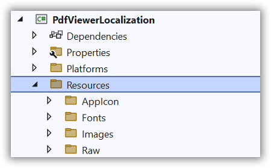
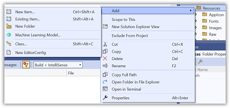
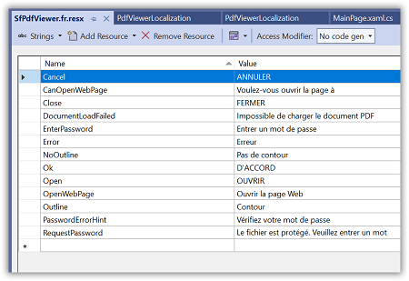

# Localization in .NET MAUI PDF Viewer (SfPdfViewer)

Localization is the process of translating the application resources into different language for the specific cultures. [SfPdfViewer](https://help.syncfusion.com/cr/maui/Syncfusion.Maui.PdfViewer.SfPdfViewer.html) is set up by default with the language code `en-US`. However, by including a resource file (.resx) in the application with the particular language code, the static text used in the `SfPdfViewer` can be localized to a different language. 

Follow the instructions below to apply localization to the `SfPdfViewer`.

## Change the current user interface culture

Set the [CurrentUICulture](https://learn.microsoft.com/en-us/dotnet/api/system.globalization.cultureinfo.currentuiculture?view=net-7.0) property in the `App.xaml.cs` file to the desired user interface culture. Refer to the following code sample to change the current culture to `French`.




using System.Globalization;

namespace PdfViewerLocalization;

public partial class App : Application
{
	public App()
	{
		InitializeComponent();
        CultureInfo.CurrentUICulture = new CultureInfo("fr-FR");
        MainPage = new AppShell();
	}
}




## Create and add the resource file into the application

Follow the below steps to create and add the resource file into the application.

1. Right-click on the `Resources` folder in the application.

    

2. Click `Add` and then `NewItem`.

    

3. In the `Add New Item` wizard, select the `Resource File` item and name the file in the format `<control name>.<culture name>.resx`. For example, name the file as SfPdfViewer.fr.resx for `French` culture.

    

4. Click `Add` to add the resource file in the Resources folder.

5. Change the `Build Action` of the resource file as `Embedded resource`.

    

6. Double tap on the resource file to add (or) edit the name and value details in the resource designer. You can find the default names and values of `SfPdfViewer` in the later section.
 
    
	
7. Set the `ResourceManager` as shown in the following code example, that looks up the resource file with the specified root name.
 



using System.Resources;
using System.Globalization;
using Syncfusion.Maui.PdfViewer;

namespace PdfViewerLocalization;

public partial class App : Application
{
	public App()
	{
		InitializeComponent();
        CultureInfo.CurrentUICulture = new CultureInfo("fr-FR");
        SfPdfViewerResources.ResourceManager = new ResourceManager("PdfViewerLocalization.Resources.SfPdfViewer", 
			Application.Current.GetType().Assembly);
        MainPage = new AppShell();
	}
}




## Default names and values

The default name and value information used in the `SfPdfViewer` in the language `en-US` is listed in the following table.

<table>
<tr>
<th>Name</th>
<th>Value</th>
</tr>
<tr>
<td>Cancel</td>
<td>CANCEL</td>
</tr>
<tr>
<td>CanOpenWebPage</td>
<td>Do you want to open</td>
</tr>
<tr>
<td>Close</td>
<td>CLOSE</td>
</tr>
<tr>
<td>DocumentLoadFailed</td>
<td>Failed to load the PDF document.</td>
</tr>
<tr>
<td>EnterPassword</td>
<td>Enter Password</td>
</tr>
<tr>
<td>Error</td>
<td>Error</td>
</tr>
<tr>
<td>NoOutline</td>
<td>No outline</td>
</tr>
<tr>
<td>Ok</td>
<td>OK</td>
</tr>
<tr>
<td>Open</td>
<td>OPEN</td>
</tr>
<tr>
<td>OpenWebPage</td>
<td>Open Web Page</td>
</tr>
<tr>
<td>Outline</td>
<td>Outline</td>
</tr>
<tr>
<td>PasswordErrorHint</td>
<td>Check your password</td>
</tr>
<tr>
<td>RequestPassword</td>
<td>This PDF file is protected. Please enter the password to open it.</td>
</tr>
</table>