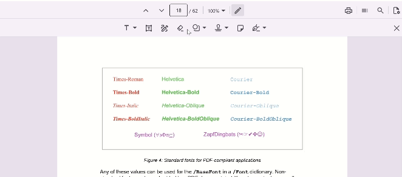
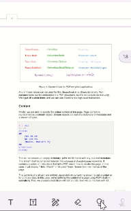

# Shape Annotations in .NET MAUI PDF Viewer (SfPdfViewer)

The shape annotations feature of [SfPdfViewer](https://help.syncfusion.com/cr/maui/Syncfusion.Maui.PdfViewer.SfPdfViewer.html) allows you to add, remove and modify shapes in the PDF document. This is useful for making corrections or emphasizing important points in the document. This section will go through the various types and functions available in PDF Viewer for working with shape annotations.

## Types of shapes

The following shape annotation types are now available in the PDF Viewer.

1.	Arrow
2.	Circle.
3.	Line.
4.	Square.
5.	Polygon.
6.	Polyline.

## Add shapes to a PDF document

This section will go through how to add shape annotations to a PDF document interactively by drawing on the PDF document as well as programmatically.

### Add shapes with UI interaction

You can interactively draw and add shape annotations to a PDF document by touch pointer or dragging the mouse down. The following steps explain how to draw a circle-shaped annotation on a PDF. Similarly, you can draw other shapes like arrows, lines, and rectangles.

1.	Set the [AnnotationMode](https://help.syncfusion.com/cr/maui/Syncfusion.Maui.PdfViewer.SfPdfViewer.html#Syncfusion_Maui_PdfViewer_SfPdfViewer_AnnotationMode) property of the SfPdfViewer to any shape (say [Circle](https://help.syncfusion.com/cr/maui/Syncfusion.Maui.PdfViewer.AnnotationMode.html#Syncfusion_Maui_PdfViewer_AnnotationMode_Circle)). It activates the circle drawing mode on the control.
2.	Place your finger (or mouse) on the screen, where you want to start drawing the circle.
3.	Draw the circle by dragging the finger (or cursor) across the screen.
4.	Finish the circle by releasing the finger (or cursor).
5.	Repeat the steps 2-4, if you want to create multiple circles on other areas during the drawing mode.
6.	Once you have done, set the `AnnotationMode` to [None](https://help.syncfusion.com/cr/maui/Syncfusion.Maui.PdfViewer.AnnotationMode.html#Syncfusion_Maui_PdfViewer_AnnotationMode_None). It will disable the circle drawing mode and save the drawn circles to the PDF pages as circle annotations. 
7.	You can later move, resize, or edit the annotation.

### Add Polygon and Polyline shapes

Adding polygon and polyline shapes with touch or mouse will vary slightly from adding other shape types. To add it interactively, refer to the following steps.

1.	Set the `AnnotationMode` property of the `SfPdfViewer` to `Polygon` or `Polyline`. It sets the control’s drawing mode to polygon or polyline respectively.
2.	To begin drawing the shape, tap the desired location on the screen (using touch or mouse).
3.	Drag the mouse pointer to a different location or just tap there. This will complete the first line segment.
4.	To create multiple connected line segments, repeat the step 3 at the necessary locations.
5.	Double tap to finish drawing the shape. The shape will be added to the PDF page. 
6.	To create multiple shapes on other areas during the drawing mode, repeat the steps 2-5.
7.	Once you have done, set the `AnnotationMode` to `None` to disable the drawing mode.
8.	You can later move, resize, or edit the annotation.

#### Enable or disable shape annotation (drawing) mode

The following code explains how to enable the `circle` annotation mode. Similarly, you can do the same for other annotations.



// Enable or activate the circle drawing mode.
void EnableCircleDrawingMode()
{
    // Set the `AnnotationMode` property of `SfPdfViewer` instance to `Circle`.
    PdfViewer.AnnotationMode = AnnotationMode.Circle;
}



Similarly, refer to following code to disable the circle annotation mode.



// Disable or deactivate the circle drawing mode.
void DisableCircleDrawingMode()
{
    // Set the `AnnotationMode` property of `SfPdfViewer` instance to `None`.
    PdfViewer.AnnotationMode = AnnotationMode.None;
}



### Add shapes programmatically

You can create and add circle annotation to a PDF document programmatically using the [AddAnnotation](https://help.syncfusion.com/cr/maui/Syncfusion.Maui.PdfViewer.SfPdfViewer.html#Syncfusion_Maui_PdfViewer_SfPdfViewer_AddAnnotation_Syncfusion_Maui_PdfViewer_Annotation_) method of the `SfPdfViewer`. The following example explains how to create a circle annotation and add it to the first page of a PDF document. Similarly, you can add other shapes also.



CircleAnnotation CreateCircleAnnoation()
{
    int pageNumber = 1;
    // Define the bounds for circle in the PDF coordinates.
    RectF circleBounds = new RectF(10, 10, 100, 100); 

    // Create a circle annotation.
    CircleAnnotation annotation = new CircleAnnotation(circleBounds, pageNumber);
    
    // Set the appearance for the circle annotation.
    annotation.Color = Colors.Red; // set the stroke color
    annotation.FillColor = Colors.Green; // set the inner fill color.
    annotation.BorderWidth = 2; // set the stroke thickness.
    annotation.Opacity = 0.75f; // set the opacity 75%

    return annotation;
}

void AddCircleAnnotation()
{
    Annotation circleAnnotation = CreateCircleAnnoation();

    //Add the circle annotation to the PDF document using the AddAnnotation method of `SfPdfViewer` instance.
    PdfViewer.AddAnnotation(circleAnnotation);
}



## Shape annotation settings

In the shape annotation mode, the shape annotations will be drawn with a default appearance. You can modify the annotation after it has been added to the pages. However, if you need to define the appearance before drawing on the document, you can change its default settings using the [AnnotationSettings](https://help.syncfusion.com/cr/maui/Syncfusion.Maui.PdfViewer.SfPdfViewer.html#Syncfusion_Maui_PdfViewer_SfPdfViewer_AnnotationSettings) property of the `SfPdfViewer`. For that you need to obtain the default shape annotation settings.

The following example explains how to obtain the default circle annotation settings and modify some of its properties. Similarly, you can modify properties of other shape annotations also.



void CustomizeDefaultCircleSettings()
{
    //Obtain the default circle annotation settings from the `SfPdfViewer` instance.
    ShapeAnnotationSettings circleAnnotationSettings = PdfViewer.AnnotationSettings.Circle;

    //Modify the default properties.

    circleAnnotationSettings.Color = Colors.Blue; // Set the default stroke color to blue.
    circleAnnotationSettings.FillColor = Colors.Red; // Set the inner fill color to red.
    circleAnnotationSettings.BorderWidth = 2; // Set the default stroke thickness to 2.
    circleAnnotationSettings.Opacity = 0.75f; // Set the default opacity to 75%.
}



## Edit the selected shape annotation

You can edit the properties of the selected shape annotation programmatically by accessing the selected annotation instance. The selected annotation instance may be obtained from the [AnnotationSelected](https://help.syncfusion.com/cr/maui/Syncfusion.Maui.PdfViewer.SfPdfViewer.html#Syncfusion_Maui_PdfViewer_SfPdfViewer_AnnotationSelected) event. The following example shows how to edit some of the properties of the selected circle annotation. Similarly, you can modify the other shape annotations properties.



/// 

/// Edit the selected circle annotation.
/// 

/// <param name="selectedAnnotation">The selected annotation instance that may be obtained from the annotation selected event</param>
void EditSelectedCicleAnnotation(Annotation selectedAnnotation)
{
    // Type cast the selected annotation as circle annotation.
    if (selectedAnnotation is CircleAnnotation circleAnnotation)
    {
        circleAnnotation.Color = Colors.Blue; // Change the color to blue.
        circleAnnotation.BorderWidth = 1; // Change the stroke thickness to 1.
        circleAnnotation.Opacity = 0.75f; // Change the opacity to 75%.
    }
}



## Border styles for shape annotation

[SfPdfViewer](https://help.syncfusion.com/cr/maui/Syncfusion.Maui.PdfViewer.SfPdfViewer.html) allows you to change the shape annotations' border style. Currently, it provides support for the following border styles.
1.	Cloudy
2.	Solid

N> By default, border style of the shape annotations is solid. The value of `BorderStyle` property is applicable only for square and polygon annotations only and it does not affect other shape annotations such as circle, line, arrow, and polyline annotations.

### Draw cloud shaped annotation

To draw a cloud annotation, set the annotation mode to either [AnnotationMode.Square](https://help.syncfusion.com/cr/maui/Syncfusion.Maui.PdfViewer.AnnotationMode.html) or [AnnotationMode.Polygon](https://help.syncfusion.com/cr/maui/Syncfusion.Maui.PdfViewer.AnnotationMode.html). Then you should set the `BorderStyle` property of the shape annotation settings to `BorderStyle.Cloudy`. The following sample code illustrates how to draw a rectangle and polygon annotation with the cloud border style.




    // Draw square cloud annotation
	SfPdfViewer pdfViewer = new SfPdfViwer();
	pdfViewer.AnnotationMode = AnnotationMode.Square;
	pdfViewer.AnnotationSettings.Rectangle.BorederStyle = BorderStyle.Cloudy;







	// Draw polygon cloud annotation
	pdfViewer.AnnotationMode = AnnotationMode.Polygon;
	pdfViewer.AnnotationSettings.Rectangle.BorederStyle = BorderStyle.Cloudy;




### Change the border style for selected polygon annotation

You can change the border style of the selected polygon annotation programmatically by accessing the selected annotation instance. The selected annotation instance may be obtained from the [AnnotationSelected](https://help.syncfusion.com/cr/maui/Syncfusion.Maui.PdfViewer.SfPdfViewer.html#Syncfusion_Maui_PdfViewer_SfPdfViewer_AnnotationSelected) event. The following example shows how to change the border style of selected polygon annotation. Similarly, you can modify the square annotations border style.



/// 

/// Change the selected shape annotation border style.
/// 

/// <param name="selectedAnnotation">The selected annotation instance that may be obtained from the annotation selected event</param>
void ChangeBorderStyleOfSelectedPolygonAnnotation(Annotation selectedAnnotation)
{
    // Type cast the selected annotation as polygon annotation. 
   if (selectedAnnotation is PolygonAnnotation polygonAnnotation) 
   {
	   polygonAnnotation.BorderStyle = BorderStyle.Cloudy; // Change the border style to cloud.
   } 

}



### Add cloud border style polygon annotation from UI

You can add cloud annotation to a PDF document using the built in toolbar.

#### Desktop toolbar

#### Mobile toolbar

### Add cloud shape annotation programmatically
You can create and add cloud polygon annotation to a PDF document programmatically using the [AddAnnotation](https://help.syncfusion.com/cr/maui/Syncfusion.Maui.PdfViewer.SfPdfViewer.html#Syncfusion_Maui_PdfViewer_SfPdfViewer_AddAnnotation_Syncfusion_Maui_PdfViewer_Annotation_) method of the [SfPdfViewer](https://help.syncfusion.com/cr/maui/Syncfusion.Maui.PdfViewer.SfPdfViewer.html). The following example explains how to create a cloud polygon annotation and add it to the first page of a PDF document. Similarly, you can add square also.



PolygonAnnotation  CreateCloudAnnoation()
{
    int pageNumber = 1;
    // Define the points for the polygon in the PDF coordinates. 
	List<PointF> polygonPoints = new List<PointF> 
	{ new PointF(10, 10), 
	  new PointF(100, 10), 
	  new PointF(100, 100), 
	  new PointF(10, 100) 
	};
    // Create a cloud border style polygon annotation.

    PolygonAnnotation  annotation = new PolygonAnnotation (polygonPoints, pageNumber);
    
    // Set the border style appearance for the polygon annotation.
    annotation.BorderStyle = BorderStyle.Cloudy // set the border style

    return annotation;
}

void AddCloudAnnotation()
{
    Annotation polygonAnnotation  = CreateCloudAnnoation();

    //Add the cloud border style polygon annotation to the PDF document using the AddAnnotation method of `SfPdfViewer` instance.
    PdfViewer.AddAnnotation(polygonAnnotation );
}



