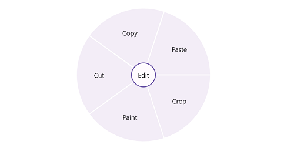

# Getting Started with .NET MAUI Radial Menu

This section guides you through setting up and configuring a [RadialMenu](https://help.syncfusion.com/cr/maui/Syncfusion.Maui.RadialMenu.html) in your .NET MAUI application. Follow the steps below to add a basic [RadialMenu](https://help.syncfusion.com/cr/maui/Syncfusion.Maui.RadialMenu.html) to your project.

To quickly get started with the .NET MAUI Radial Menu, watch this video.



## Prerequisites

Before proceeding, ensure the following are set up:
1. Install [.NET 8 SDK](https://dotnet.microsoft.com/en-us/download/dotnet/7.0) or later is installed.
1. Set up a .NET MAUI environment with Visual Studio 2022 (v17.3 or later) or Visual Studio Code. For Visual Studio Code users, ensure that the .NET MAUI workload is installed and configured as described [here.](https://learn.microsoft.com/en-us/dotnet/maui/get-started/installation?view=net-maui-8.0&tabs=visual-studio-code)

## Step 1: Create a New MAUI Project

### Visual Studio

1. Go to **File > New > Project** and choose the **.NET MAUI App** template.
1. Name the project and choose a location. Then, click **Next.**
1. Select the .NET framework version and click **Create**.

### Visual Studio Code

1. Open the command palette by pressing `Ctrl+Shift+P` and type **.NET:New Project** and enter.
1. Choose the **.NET MAUI App** template.
1. Select the project location, type the project name and press **Enter.**
1. Then choose **Create project.**

## Step 2: Install the Syncfusion MAUI RadialMenu NuGet Package

1. In **Solution Explorer,** right-click the project and choose **Manage NuGet Packages.**
1. Search for [Syncfusion.Maui.RadialMenu](https://www.nuget.org/packages/Syncfusion.Maui.RadialMenu/) and install the latest version.
1. Ensure the necessary dependencies are installed correctly, and the project is restored.

## Step 3: Register the handler

[Syncfusion.Maui.Core](https://www.nuget.org/packages/Syncfusion.Maui.Core/) NuGet is a dependent package for all Syncfusion controls of .NET MAUI. In the MauiProgram.cs file, register the handler for Syncfusion core.




    using Syncfusion.Maui.Core.Hosting;
    public static class MauiProgram
    {
	    public static MauiApp CreateMauiApp()
	    {
	        var builder = MauiApp.CreateBuilder();
		    builder
			    .ConfigureSyncfusionCore()
			    .UseMauiApp<App>()
			    .ConfigureFonts(fonts =>
			    {
				    fonts.AddFont("OpenSans-Regular.ttf", "OpenSansRegular");
				    fonts.AddFont("OpenSans-Semibold.ttf", "OpenSansSemibold");
			    });

		    return builder.Build();
	    }
    }



l
## Step 4:  Add a RadialMenu

1. To initialize the control, import the RadialMenu namespace into your code.
1. Initialize [RadialMenu](https://help.syncfusion.com/cr/maui/Syncfusion.Maui.RadialMenu.html)



<ContentPage
    . . .    
    xmlns:radialMenu="clr-namespace:Syncfusion.Maui.RadialMenu;assembly=Syncfusion.Maui.RadialMenu">
    <StackLayout>
        <radialMenu:SfRadialMenu />
    </StackLayout>
</ContentPage>

    




using Syncfusion.Maui.RadialMenu;
namespace RadialMenuGettingStarted
{
    public partial class MainPage : ContentPage
    {
        public MainPage()
        {
            InitializeComponent();           
            StackLayout stackLayout = new StackLayout();
            SfRadialMenu radialMenu = new SfRadialMenu();
            stackLayout.Children.Add(radialMenu);
            this.Content = stackLayout;
        }
    }   
}




## Step 5:  Adding radial menu with items





<ContentPage 
            ...
             xmlns:radialMenu="clr-namespace:Syncfusion.Maui.RadialMenu;assembly=Syncfusion.Maui.RadialMenu">
        <radialMenu:SfRadialMenu x:Name="radialMenu" 
                                CenterButtonText="Edit"
                                CenterButtonFontSize="15">
            <radialMenu:SfRadialMenu.Items>
                <radialMenu:SfRadialMenuItem Text="Cut"
                                            FontSize="15"/>
                <radialMenu:SfRadialMenuItem Text="Copy"
                                            FontSize="15"/>
                <radialMenu:SfRadialMenuItem Text="Paste"
                                            FontSize="15"/>
                <radialMenu:SfRadialMenuItem Text="Crop"
                                            FontSize="15"/>
                <radialMenu:SfRadialMenuItem Text="Paint"
                                            FontSize="15"/>
            </radialMenu:SfRadialMenu.Items>
        </radialMenu:SfRadialMenu>
</ContentPage>





using Syncfusion.Maui.RadialMenu;

namespace RadialMenuGettingStarted
{
    public partial class MainPage : ContentPage
    {
        public MainPage()
        {
            InitializeComponent();

            SfRadialMenu radialMenu = new SfRadialMenu()
            {
                CenterButtonText = "Edit",
                CenterButtonFontSize = 15
            };

            RadialMenuItemsCollection itemCollection = new RadialMenuItemsCollection();
            itemCollection.Add(new SfRadialMenuItem()
            {
                Text = "Cut",
                FontSize = 15
            });
            itemCollection.Add(new SfRadialMenuItem()
            {
                Text = "Copy",
                FontSize = 15
            });
            itemCollection.Add(new SfRadialMenuItem()
            {
                Text = "Paste",
                FontSize = 15
            });
            itemCollection.Add(new SfRadialMenuItem()
            {
                Text = "Crop",
                FontSize = 15
            });
            itemCollection.Add(new SfRadialMenuItem()
            {
                Text = "Paint",
                FontSize = 15
            });
            radialMenu.Items = itemCollection;
            this.Content = radialMenu;
        }
    }
}





N> You can find the getting started sample of .NET MAUI SfRadialMenu from this [link.](https://github.com/SyncfusionExamples/Getting-Started-with-.NET-MAUI-Radial-Menu)

