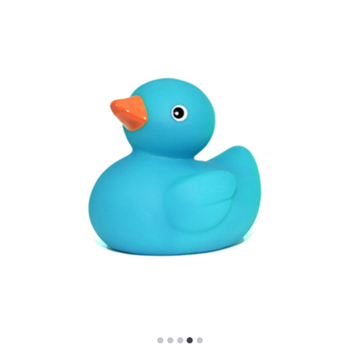
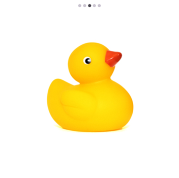

# Getting Started with .NET MAUI Rotator

This section explains how to add the Rotator control and bind data to it. This section covers only the basic features needed to get started with the Syncfusion [.NET MAUI Rotator](https://www.syncfusion.com/maui-controls/maui-rotator) control.

## Prerequisites

Before proceeding, ensure the following are in place:

1.Install [.NET 7 SDK](https://dotnet.microsoft.com/en-us/download/dotnet/7.0) or later.
2.Set up a .NET MAUI environment with Visual Studio 2022 (v17.3 or later) or VS Code. For VS Code users, ensure that the .NET MAUI workload is installed and configured as described [here](https://github.com/dotnet/maui/wiki/VS-Code-setup).

## Step 1: Create a New MAUI Project

1.Open Visual Studio or VS Code.
2.Go to **File > New > Project** and choose the **.NET MAUI App** template.
3.Name the project and choose a location, then click **Create**.

## Step 2: Install the Syncfusion MAUI Rotator NuGet Package

1.In **Solution Explorer**, right-click the project and choose **Manage NuGet Packages**.
2.Search for [Syncfusion.Maui.Rotator](https://www.nuget.org/packages/Syncfusion.Maui.Rotator) and install the latest version.
3.Ensure the necessary dependencies are installed correctly, and the project is restored.

## Step 3: Register the Handler

In the MauiProgram.cs file, register the handler for the Syncfusion core.



using Microsoft.Maui;
using Microsoft.Maui.Hosting;
using Microsoft.Maui.Controls.Compatibility;
using Microsoft.Maui.Controls.Hosting;
using Microsoft.Maui.Controls.Xaml;
using Syncfusion.Maui.Core.Hosting;

namespace Rotator
{
    public static class MauiProgram
    {
        public static MauiApp CreateMauiApp()
        {
            var builder = MauiApp.CreateBuilder();
            builder
            .UseMauiApp<App>()
            .ConfigureSyncfusionCore()
            .ConfigureFonts(fonts =>
            {
                fonts.AddFont("OpenSans-Regular.ttf", "OpenSansRegular");
            });

            return builder.Build();
        }      
    }
}   

 

## Step 4:  Add a Basic Rotator

Step 1: Add the NuGet to the project as discussed in the above reference section. 

Step 2: Add the namespace as shown in the following code sample.




    xmlns:syncfusion="clr-namespace:Syncfusion.Maui.Rotator;assembly=Syncfusion.Maui.Rotator"




    using Syncfusion.Maui.Rotator;




## Create a Simple SfRotator 

The [SfRotator](https://help.syncfusion.com/cr/maui/Syncfusion.Maui.Rotator.SfRotator.html?tabs=tabid-1)control is configured entirely in C# code or by using XAML markup.





<?xml version="1.0" encoding="utf-8" ?>
<ContentPage xmlns="http://schemas.microsoft.com/dotnet/2021/maui"
            xmlns:x="http://schemas.microsoft.com/winfx/2009/xaml"
            xmlns:syncfusion="clr-namespace:Syncfusion.Maui.Rotator;assembly=Syncfusion.Maui.Rotator"
            xmlns:local="clr-namespace:Rotator"
            x:Class="GettingStarted.Rotator">
<ContentPage.Content>
<syncfusion:SfRotator x:Name="rotator" />	
</ContentPage.Content>
</ContentPage>
	


		

using Syncfusion.Maui.Rotator;

namespace GettingStarted
{
public partial class RotatorControlPage : ContentPage
    {
        public RotatorControlPage()
        {
            InitializeComponent();
            SfRotator rotator = new SfRotator();
            this.Content = rotator;
        }
    }
}
        




## Add Rotator Items

We can populate the rotator’s items by using any one of the following ways,

* Through [SfRotatorItem](https://help.syncfusion.com/cr/maui/Syncfusion.Maui.Rotator.SfRotatorItem.html)

* Through [ItemTemplate](https://help.syncfusion.com/cr/maui/Syncfusion.Maui.Rotator.SfRotator.html#Syncfusion_Maui_Rotator_SfRotator_ItemTemplate)

The below is an simple example for adding rotator items using SfRotatorItem, for more details on populating data click [Here](https://help.syncfusion.com/maui/rotator/Populating-data)

The following code example illustrates to add list of Images in Rotator ,





using Syncfusion.Maui.Core.Rotator;

namespace Rotator
{
    public partial class Rotator : ContentPage
    {
        SfRotator rotator = new SfRotator();
        StackLayout stackLayout = new StackLayout();
        public Rotator()
        {
            InitializeComponent ();
            stackLayout.HeightRequest = 300;
            List<SfRotatorItem> collectionOfItems = new List<SfRotatorItem>();
            collectionOfItems.Add(new SfRotatorItem() { Image = "image1.png" });
            collectionOfItems.Add(new SfRotatorItem() { Image = "image2.png" });
            collectionOfItems.Add(new SfRotatorItem() { Image = "image3.png" });
            collectionOfItems.Add(new SfRotatorItem() { Image = "image4.png" });
            collectionOfItems.Add(new SfRotatorItem() { Image = "image5.png" });
            rotator.ItemsSource = collectionOfItems;
            stackLayout.Children.Add(rotator);
            this.Content = stackLayout;
        }
    }
}





N> Ensure that the images mentioned in the code snippets are located in the **Resources** folder of your sample project.
 
## Setting Navigation Mode

[SfRotator](https://help.syncfusion.com/cr/maui/Syncfusion.Maui.Rotator.SfRotator.html?tabs=tabid-1) provides option to display the navigating items either in Thumbnail or Dots mode. The navigation mode for navigating the items can be decided using [NavigationStripMode](https://help.syncfusion.com/cr/maui/Syncfusion.Maui.Rotator.SfRotator.html#Syncfusion_Maui_Rotator_SfRotator_NavigationStripMode) property.





<?xml version="1.0" encoding="utf-8" ?>
<ContentPage xmlns="http://schemas.microsoft.com/dotnet/2021/maui"
            xmlns:x="http://schemas.microsoft.com/winfx/2009/xaml"
            xmlns:syncfusion="clr-namespace:Syncfusion.Maui.Rotator;assembly=Syncfusion.Maui.Rotator"
            xmlns:local="clr-namespace:Rotator"
            x:Class="Rotator.Rotator">
    <ContentPage.BindingContext>
        <local:RotatorViewModel/>
    </ContentPage.BindingContext>
    <ContentPage.Content>
        <syncfusion:SfRotator x:Name="rotator" 
                        NavigationDelay="2000" 
                        ItemsSource="{Binding ImageCollection}" 
                        SelectedIndex="2"
                        NavigationDirection="Horizontal"
                        NavigationStripMode="Thumbnail" 
                        BackgroundColor="#ececec"
                        WidthRequest="550"
                        HeightRequest="550">
            <syncfusion:SfRotator.ItemTemplate>
                <DataTemplate>
                    <Image  Source="{Binding Image}"/>
                </DataTemplate>
            </syncfusion:SfRotator.ItemTemplate>
        </syncfusion:SfRotator>
    </ContentPage.Content>
</ContentPage>



	

using Syncfusion.Maui.Core.Rotator;
using Syncfusion.Maui.Rotator;

namespace Rotator
{
    public partial class Rotator : ContentPage
    {
        public Rotator()
        {
            InitializeComponent ();
            SfRotator rotator = new SfRotator();
            var ImageCollection = new List<RotatorModel> {
            new RotatorModel ("image1.png"),
            new RotatorModel ("image2.png"),
            new RotatorModel ("image3.png"),
            new RotatorModel ("image4.png"),
            new RotatorModel ("image5.png")
            };
            var itemTemplate = new DataTemplate(() =>
            {
                var grid = new Grid();
                var nameLabel = new Image();
                nameLabel.SetBinding(Image.SourceProperty, "Image");
                grid.Children.Add(nameLabel);
                return grid;
            });
            rotator.ItemTemplate = itemTemplate;
            rotator.NavigationStripMode = NavigationStripMode.Thumbnail;
            rotator.ItemsSource = ImageCollection;
            this.Content = rotator;
        }
    }
    public class RotatorModel
    {
        public RotatorModel(string imageString)
        {
            Image = imageString;
        }
        private String _image;
        public String Image
        {
            get { return _image; }
            set { _image = value; }
        }
    }
}





## Customizing Position

The placement position of navigation strip items such as [Thumbnail](https://help.syncfusion.com/cr/maui/Syncfusion.Maui.Core.Rotator.NavigationStripMode.html#Syncfusion_Maui_Core_Rotator_NavigationStripMode_Thumbnail) or [Dots](https://help.syncfusion.com/cr/maui/Syncfusion.Maui.Core.Rotator.NavigationStripMode.html#Syncfusion_Maui_Core_Rotator_NavigationStripMode_Dots) can be customized in [SfRotator](https://help.syncfusion.com/cr/maui/Syncfusion.Maui.Rotator.SfRotator.html?tabs=tabid-1). This can be specified using [NavigationStripMode](https://help.syncfusion.com/cr/maui/Syncfusion.Maui.Rotator.SfRotator.html#Syncfusion_Maui_Rotator_SfRotator_NavigationStripMode) property.   





<?xml version="1.0" encoding="utf-8" ?>
<ContentPage xmlns="http://schemas.microsoft.com/dotnet/2021/maui"
            xmlns:x="http://schemas.microsoft.com/winfx/2009/xaml"
            xmlns:syncfusion="clr-namespace:Syncfusion.Maui.Rotator;assembly=Syncfusion.Maui.Rotator"
            xmlns:local="clr-namespace:Rotator"
            x:Class="Rotator.Rotator">
    <ContentPage.BindingContext>
        <local:RotatorViewModel/>
    </ContentPage.BindingContext>
    <ContentPage.Content>
        <syncfusion:SfRotator x:Name="rotator" 
                        NavigationDelay="2000" 
                        ItemsSource="{Binding ImageCollection}" 
                        SelectedIndex="2"
                        NavigationDirection="Horizontal"
                        NavigationStripMode="Dots" 
                        BackgroundColor="#ececec"
                        NavigationStripPosition="Top"
                        WidthRequest="550"
                        HeightRequest="550">
            <syncfusion:SfRotator.ItemTemplate>
                <DataTemplate>
                    <Image  Source="{Binding Image}"/>
                </DataTemplate>
            </syncfusion:SfRotator.ItemTemplate>
        </syncfusion:SfRotator>
    </ContentPage.Content>
</ContentPage>	



	

using Syncfusion.Maui.Core.Rotator;
using Syncfusion.Maui.Rotator;

namespace Rotator
{
    public partial class Rotator : ContentPage
    {
        public Rotator()
        {
            InitializeComponent ();
            SfRotator rotator = new SfRotator();
            var ImageCollection = new List<RotatorModel> {
            new RotatorModel ("image1.png"),
            new RotatorModel ("image2.png"),
            new RotatorModel ("image3.png"),
            new RotatorModel ("image4.png"),
            new RotatorModel ("image5.png")
            };
            var itemTemplate = new DataTemplate(() =>
            {
                var grid = new Grid();
                var nameLabel = new Image();
                nameLabel.SetBinding(Image.SourceProperty, "Image");
                grid.Children.Add(nameLabel);
                return grid;
            });
            rotator.ItemTemplate = itemTemplate;
            rotator.NavigationStripMode = NavigationStripMode.Dots;
            rotator.NavigationStripPosition = NavigationStripPosition.Top;
            rotator.WidthRequest=550;
            rotator.HeightRequest=550;
            rotator.ItemsSource = ImageCollection;
            this.Content = rotator;
        }
    }
    public class RotatorModel
    {
        public RotatorModel(string imageString)
        {
            Image = imageString;
        }
        private String _image;
        public String Image
        {
            get { return _image; }
            set { _image = value; }
        }
    }
}
	




N> You can find the getting started sample of .NET MAUI SfRotator from this [link.](https://github.com/SyncfusionExamples/Getting-Started-with-.NET-MAUI-Rotator)