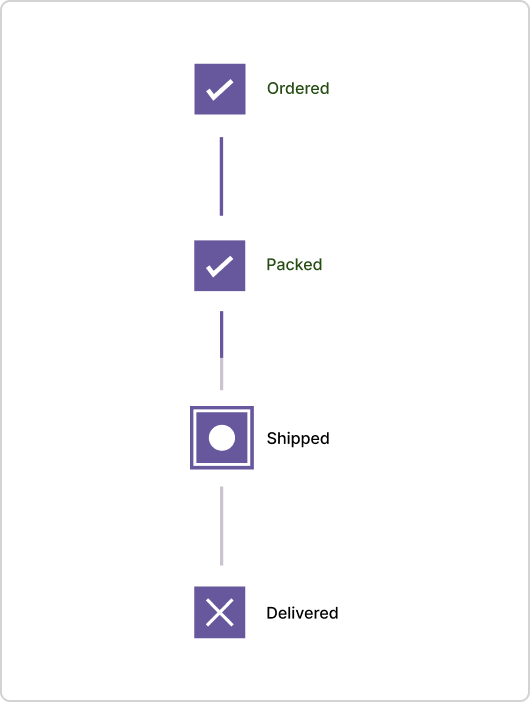

# Customizations in .NET MAUI StepProgressBar (SfStepProgressBar)
You can highly customize the appearance of the Step progress bar background color, step size, content size, animations, and more.

## Customize step shape
Customize the shape of the step by using the [ShapeType]() property from `StepSettings`. By default the value of `ShapeType` is `Circle`. 




<progressBar:SfStepProgressBar x:Name = "stepProgressBar" ItemsSource="{Binding ShipmentInfoCollection}"
                ActiveStepIndex="2" ActiveStepProgressValue="50">
    <progressBar:SfStepProgressBar.InProgressStepSettings>
        <progressBar:StepSettings Background="#ff67579c" ContentType="Dot" ShapeType="Square" ContentFillColor="White"/>
    </progressBar:SfStepProgressBar.InProgressStepSettings>
    <progressBar:SfStepProgressBar.CompletedStepSettings>
        <progressBar:StepSettings Background="#ff67579c" ContentType="Tick" ShapeType="Square" ContentFillColor="White"/>
    </progressBar:SfStepProgressBar.CompletedStepSettings>
    <progressBar:SfStepProgressBar.NotStartedStepSettings>
        <progressBar:StepSettings Background="#ff67579c" ContentType="Cross" ShapeType="Square" ContentFillColor="White"/>
    </progressBar:SfStepProgressBar.NotStartedStepSettings>
</progressBar:SfStepProgressBar>





public MainPage()
{
    InitializeComponent();
    SfStepProgressBar sfstepProgressbar = new SfStepProgressBar()
    {
        ActiveStepIndex = 2,
        ActiveStepProgressValue=50,
    };
          
    StepSettings inProgressStepSettings = new StepSettings();
    inProgressStepSettings.Background = Color.FromHex("#ff67579c");
    inProgressStepSettings.ContentType = StepContentType.Dot;
    inProgressStepSettings.ShapeType = StepShapeType.Square;
    inProgressStepSettings.ContentFillColor = Colors.White;

    StepSettings completedStepSettings = new StepSettings();
    completedStepSettings.Background = Color.FromHex("#ff67579c");
    completedStepSettings.ContentType = StepContentType.Tick;
    completedStepSettings.ShapeType = StepShapeType.Square;
    completedStepSettings.ContentFillColor = Colors.White;

    StepSettings notStartedStepSettings = new StepSettings();
    notStartedStepSettings.Background = Color.FromHex("#ff67579c");
    notStartedStepSettings.ContentType = StepContentType.Cross;
    notStartedStepSettings.ShapeType = StepShapeType.Square;
    notStartedStepSettings.ContentFillColor = Colors.White;

    sfstepProgressbar.InProgressStepSettings = inProgressStepSettings;
    sfstepProgressbar.NotStartedStepSettings = notStartedStepSettings;
    sfstepProgressbar.CompletedStepSettings = completedStepSettings;

    this.Content = sfstepProgressbar;
}




 

## Customize step content 
Customize the step content type, size, active step index, stroke width, and active step progress value by using these properties, [ContentType]() with [Numbering](), [Tick](), [Cross](), [Dot]() and [Images](). 




<progressBar:SfStepProgressBar x:Name = "stepProgressBar"
                            StepSize="40"
                            StepContentSize="25"
							ActiveStepIndex="1"
							StepStrokeWidth="10"    
                            ActiveStepProgressValue="60">

    <progressBar:SfStepProgressBar.InProgressStepSettings>
        <progressBar:StepSettings Background="#ff67579c" ContentType="Dot" ContentFillColor="White"/>
    </progressBar:SfStepProgressBar.InProgressStepSettings>
    <progressBar:SfStepProgressBar.CompletedStepSettings>
        <progressBar:StepSettings Background="#ff67579c" ContentType="Tick" ContentFillColor="White"/>
    </progressBar:SfStepProgressBar.CompletedStepSettings>
    <progressBar:SfStepProgressBar.NotStartedStepSettings>
        <progressBar:StepSettings Background="#ff67579c" ContentType="Cross" ContentFillColor="White"/>
    </progressBar:SfStepProgressBar.NotStartedStepSettings>
</progressBar:SfStepProgressBar>





SfStepProgressBar sfstepProgressbar = new SfStepProgressBar()
{
    StepContentSize = 25,
    StepSize = 40
};
          
StepSettings inProgressStepSettings = new StepSettings();
inProgressStepSettings.Background = Color.FromHex("#ff67579c");
inProgressStepSettings.ContentType = StepContentType.Dot;
inProgressStepSettings.ContentFillColor = Colors.White;

StepSettings completedStepSettings = new StepSettings();
completedStepSettings.Background = Color.FromHex("#ff67579c");
completedStepSettings.ContentType = StepContentType.Tick;
completedStepSettings.ContentFillColor = Colors.White;

StepSettings notStartedStepSettings = new StepSettings();
notStartedStepSettings.Background = Color.FromHex("#ff67579c");
notStartedStepSettings.ContentType = StepContentType.Cross;
notStartedStepSettings.ContentFillColor = Colors.White;

sfstepProgressbar.InProgressStepSettings = inProgressStepSettings;
sfstepProgressbar.NotStartedStepSettings = notStartedStepSettings;
sfstepProgressbar.CompletedStepSettings = completedStepSettings;

this.Content = sfstepProgressbar;




 
 
## Animation duration
Customize the progress animation duration by using the [ProgressAnimationDuration]() property in `SfStepProgressBar`. By default the value of the animation duration is `1000`.




<progressBar:SfStepProgressBar x:Name = "stepProgressBar" 
                        ProgressBarBackground="LightBlue" 
						ProgressAnimationDuration="2000"
						ActiveStepIndex="1" 
						ActiveStepProgressValue="40">
</progressBar:SfStepProgressBar>





public MainPage()
{
    InitializeComponent();
    SfStepProgressBar sfstepProgressbar = new SfStepProgressBar()
    {
        ActiveStepIndex = 1,
        ActiveStepProgressValue=50,
        ProgressBarBackground=Colors.LightBlue,
        ProgressAnimationDuration=2000
    };
          
    this.Content = sfstepProgressbar;
}




## Progress bar background
You can customize the progress bar background of the step progress bar by using the [ProgressBarBackground]() property in `SfStepProgressBar`.




<progressBar:SfStepProgressBar x:Name = "stepProgressBar" 
                        ProgressBarBackground="LightBlue">
</progressBar:SfStepProgressBar>





public MainPage()
{
    InitializeComponent();
    SfStepProgressBar sfstepProgressbar = new SfStepProgressBar()
    {
        ProgressBarBackground=Colors.LightBlue,
    };
          
    this.Content = sfstepProgressbar;
}




## Customize step appearance
You can customize the appearance of the steps by using the [ShapeType](), [Background](), [ContentType](), [ContentFillColor](), [ProgressColor](), [Stroke](), and [TextStyle] properties from the InProgressStepSettings for the in-progress state, CompletedStepSettings for the completed state, and NotStartedStepSettings for the not-started state. 




<progressBar:SfStepProgressBar x:Name = "stepProgressBar" ItemsSource="{Binding ShipmentInfoCollection}"
                ActiveStepIndex="2" ActiveStepProgressValue="50">
    <progressBar:SfStepProgressBar.InProgressStepSettings>
            <progressBar:StepSettings Background="#ff67579c" ContentType="Dot" ShapeType="Circle" ProgressColor="Orange" ContentFillColor="White" Stroke="DarkViolet">
                <progressBar:StepSettings.TextStyle>
                    <progressBar:StepTextStyle TextColor="CadetBlue" FontAttributes="Bold"/>
                </progressBar:StepSettings.TextStyle>
            </progressBar:StepSettings>
        </progressBar:SfStepProgressBar.InProgressStepSettings>
    <progressBar:SfStepProgressBar.CompletedStepSettings>
            <progressBar:StepSettings Background="#ff67579c" ContentType="Tick" ShapeType="Circle" ProgressColor="Orange" ContentFillColor="White" Stroke="DarkViolet">
                <progressBar:StepSettings.TextStyle>
                    <progressBar:StepTextStyle TextColor="CadetBlue" FontAttributes="Bold"/>
                </progressBar:StepSettings.TextStyle>
            </progressBar:StepSettings>
        </progressBar:SfStepProgressBar.CompletedStepSettings>
    <progressBar:SfStepProgressBar.NotStartedStepSettings>
            <progressBar:StepSettings Background="#ff67579c" ContentType="Cross" ShapeType="Circle" ProgressColor="Orange" ContentFillColor="White"  Stroke="DarkViolet">
                <progressBar:StepSettings.TextStyle>
                    <progressBar:StepTextStyle TextColor="CadetBlue" FontAttributes="Bold"/>
                </progressBar:StepSettings.TextStyle>
            </progressBar:StepSettings>
        </progressBar:SfStepProgressBar.NotStartedStepSettings>
</progressBar:SfStepProgressBar>





public MainPage()
{
    InitializeComponent();
        SfStepProgressBar sfstepProgressbar = new SfStepProgressBar()
        {
            ActiveStepIndex = 2,
            ActiveStepProgressValue = 50,
    };

    StepTextStyle inprogressTextStyle = new StepTextStyle();
    inprogressTextStyle.TextColor = Colors.CadetBlue;
    inprogressTextStyle.FontAttributes = FontAttributes.Bold;

    StepTextStyle completedTextStyle = new StepTextStyle();
    completedTextStyle.TextColor = Colors.CadetBlue;
    completedTextStyle.FontAttributes = FontAttributes.Bold;

    StepTextStyle notStartedTextStyle = new StepTextStyle();
    notStartedTextStyle.TextColor = Colors.CadetBlue;
    notStartedTextStyle.FontAttributes = FontAttributes.Bold;

    StepSettings inProgressStepSettings = new StepSettings();
    inProgressStepSettings.Background = Color.FromHex("#ff67579c");
    inProgressStepSettings.ContentType = StepContentType.Dot;
    inProgressStepSettings.ShapeType = StepShapeType.Square;
    inProgressStepSettings.ContentFillColor = Colors.White;
    inProgressStepSettings.Stroke= Colors.DarkViolet;
    inProgressStepSettings.TextStyle = inprogressTextStyle;

    StepSettings completedStepSettings = new StepSettings();
    completedStepSettings.Background = Color.FromHex("#ff67579c");
    completedStepSettings.ContentType = StepContentType.Tick;
    completedStepSettings.ShapeType = StepShapeType.Square;
    completedStepSettings.ContentFillColor = Colors.White;
    completedStepSettings.Stroke = Colors.DarkViolet;
    completedStepSettings.TextStyle = completedTextStyle;

    StepSettings notStartedStepSettings = new StepSettings();
    notStartedStepSettings.Background = Color.FromHex("#ff67579c");
    notStartedStepSettings.ContentType = StepContentType.Cross;
    notStartedStepSettings.ShapeType = StepShapeType.Square;
    notStartedStepSettings.ContentFillColor = Colors.White;
    notStartedStepSettings.Stroke = Colors.DarkViolet;
    notStartedStepSettings.TextStyle = notStartedTextStyle;

    sfstepProgressbar.InProgressStepSettings = inProgressStepSettings;
    sfstepProgressbar.NotStartedStepSettings = notStartedStepSettings;
    sfstepProgressbar.CompletedStepSettings = completedStepSettings;

    this.Content = sfstepProgressbar;
}




 