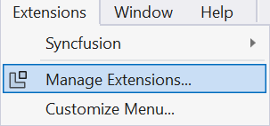
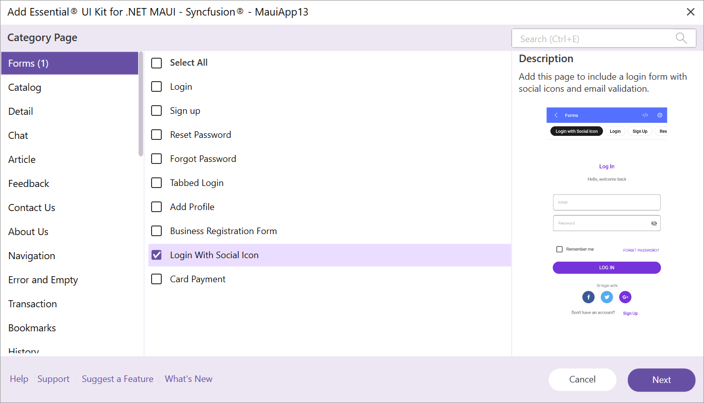
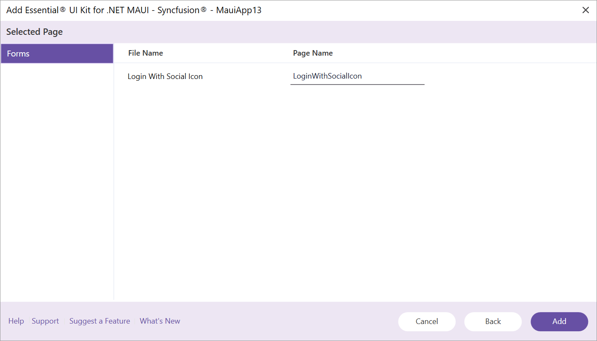

# Getting Started with MAUI UI Kit

The UI Kit screens can be added to your application in the following two ways:

1. Using **Essential UI Kit for MAUI** Visual Studio extension.

2. Copying the files from our open-source [GitHub repository](https://github.com/syncfusion/essential-ui-kit-for-.net-maui).

## Essential UI Kit for MAUI Extension

This is the simplest method to integrate pre-defined screens into your application. The following steps outline how to add screens to your app using our extension:

### Steps to Use Essential UI Kit for MAUI Extension

1. Open Visual Studio.

2. Go to Extension, and then click Manage Extensions as shown in the following screenshot.

   

3. Search for **Essential UI Kit for MAUI**, and then install it.

   

4. Restart the Visual Studio and allow it to complete the installation. 

5. Now, open an existing MAUI application or create a new application as per your requirements.
 
6. Right-click the MAUI [NETStandard] project, and you can see the **Essential UI Kit for MAUI** option.

N> The **Essential UI Kit for MAUI** add-in will be shown when the project have the **MAUI** NuGet package as a reference and also, MAUI project should be a NETStandard project.

7. Select the category and pages you need to add in your application. In the following screenshot, the **Login with Social Icon** screen has been selected from the **Forms** category. 

   
8. Clicking the 'Next' button will navigate to the following page to add page name : 

   

9. Clicking the 'Add' button will include the selected page to your project. The necessary class files, resources, and NuGet package references will automatically be added to your project as shown in the following screenshot.

   
   
   

## How to render the added page

In a MAUI demo application, to set the added page as the start-up page, you must define it in the App.xaml.cs file.
For example, if you added the Login with Social Icon Page, you should invoke the page as shown in the following code:



MainPage=new SampleFormsApplication.Views.Forms.LoginWithSocialIcon();



In real-world applications, you may need to do the following to use these XAML pages:
1. Update the services to fetch data from a remote server or local database.
2. Wire up the navigation and update the business logic in the view models.

## Requesting Screens and Reporting Bugs

If you would like to request a new screen or report a bug in existing screens, create a feature request or submit a bug through our [feedback portal](https://www.syncfusion.com/feedback/maui?control=ui-kit)