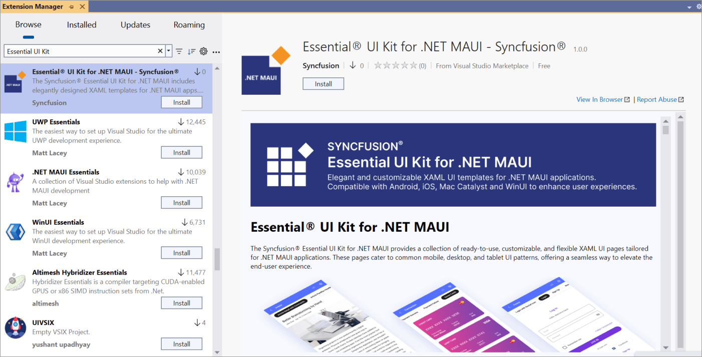

# Getting Started with MAUI UI Kit

The UI Kit screens can be added in your application by the following two ways:

1. Using **Essential UI Kit for MAUI** Visual Studio extension.

2. Copying the files from our open source [GitHub repository](https://github.com/syncfusion/essential-ui-kit-for-.net-maui).

## Assembly deployment

After installing [Essential Studio for MAUI](https://www.syncfusion.com/downloads/maui), you can find all the required assemblies in the installation folders, {Syncfusion Essential Studio Installed location} \Essential Studio\\{Version #}\Xamarin\lib.

E.g.: C:\Program Files (x86) \Syncfusion\Essential Studio\19.1.0.54\Xamarin\lib

N> Assemblies can be found in unzipped package location(Documents/Syncfusion/{Version #}/Xamarin/lib) in Mac.

## Essential UI Kit for MAUI Extension

This is the easiest way to add the pre-defined screens to your application. The following steps explain how to add screens to an application with our extension: 

### Extension for Windows

1. Open Visual Studio.

2. Go to Extension, and then click Manage Extensions as shown in the following screenshot.

   

3. Search for **Essential UI Kit for MAUI**, and then install it.

   

4. Restart the Visual Studio and allow it to complete the installation. 

5. Now, open an existing MAUI application or create a new application as per your requirements.
 
6. Right-click the MAUI [NETStandard] project, and you can see the **Essential UI Kit for MAUI** option.

N> The **Essential UI Kit for MAUI** add-in will be shown when the project have the **MAUI** NuGet package as a reference and also, MAUI project should be a NETStandard project.

7. Select the category and pages you need to add in your application. In the following screenshot, the **Login with Social Icon** screen has been selected from the **Login** category. 

   

8. Clicking the 'Add' button will include the selected page to your project. The necessary class files, resources, and NuGet package references will automatically be added to your project as shown in the following screenshot.

   

## How to render the added page

In a MAUI demo application, you must make the added page as the start-up page in the App.xaml.cs file. 
Example: If you added the Login Page, then you must invoke the page as demonstrated in the following code.


MainPage = new SampleFormsApplication.Views.Login.LoginPage();
 

In real-world applications, you may need to do the following to use these XAML pages:
1. Update the services for fetching the data from remote server or local database.
2. Wire up the navigation and update the business logics in view models.

## Requesting Screens and Reporting Bugs

If you would like to request a new screen or report a bug in existing screens, create a feature request or submit a bug through our [feedback portal](https://www.syncfusion.com/feedback/maui?control=ui-kit)